# Fluxos Operacionais — TradeK OS

## 1. Captação e qualificação geral

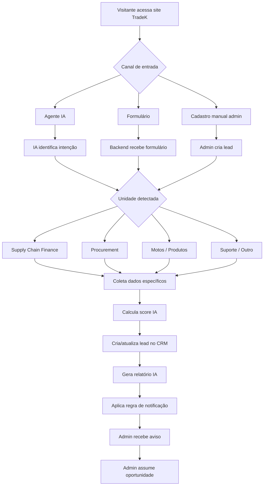

## 2. Agente IA no site

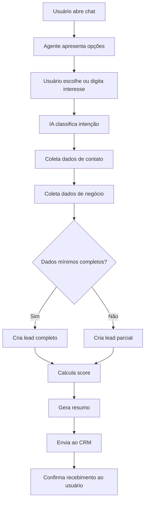

## 3. Supply Chain Finance

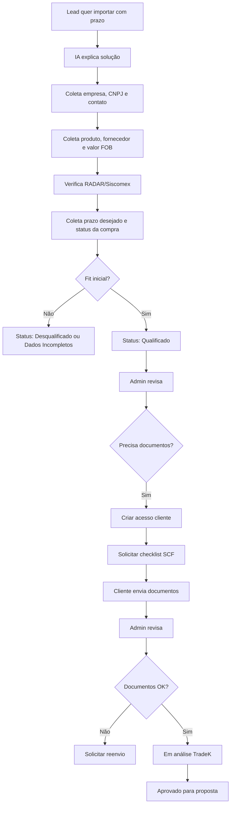

## 4. Procurement

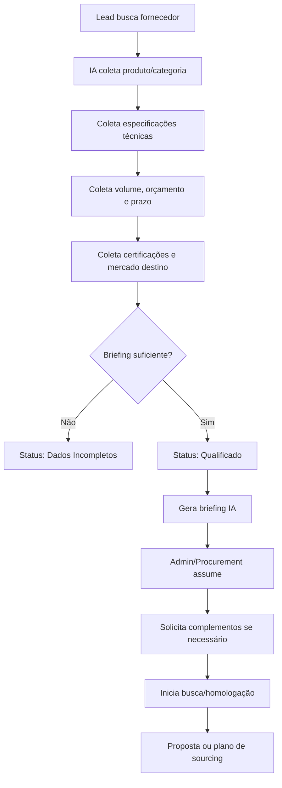

## 5. Motos / Produtos

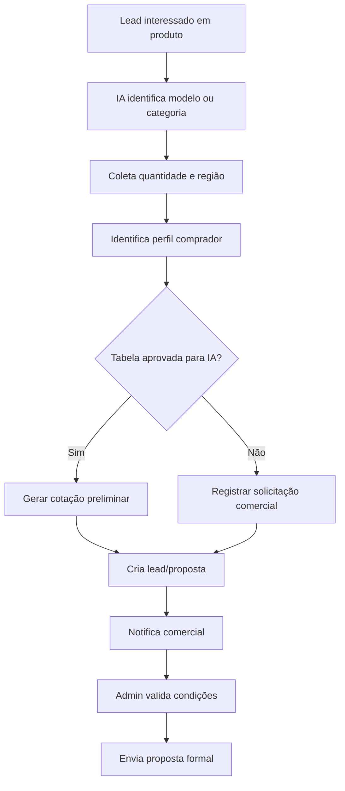

## 6. Status do CRM

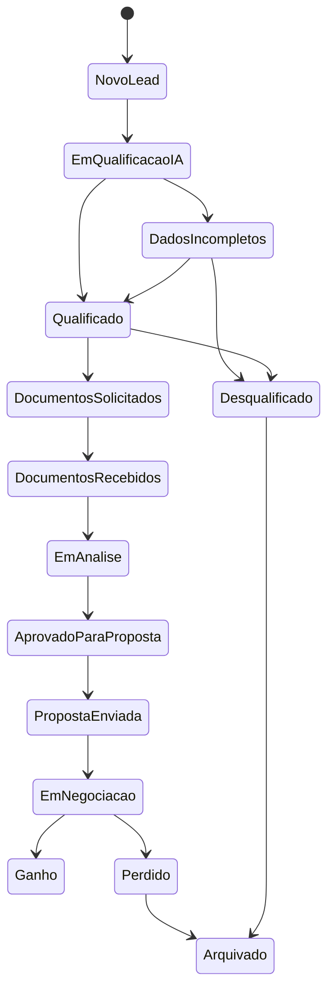

## 7. Criação de usuário cliente

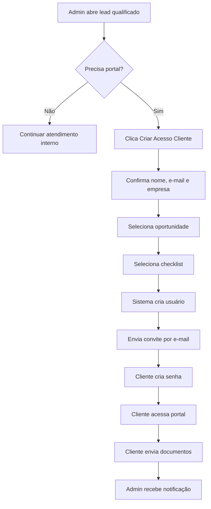

## 8. Documentos

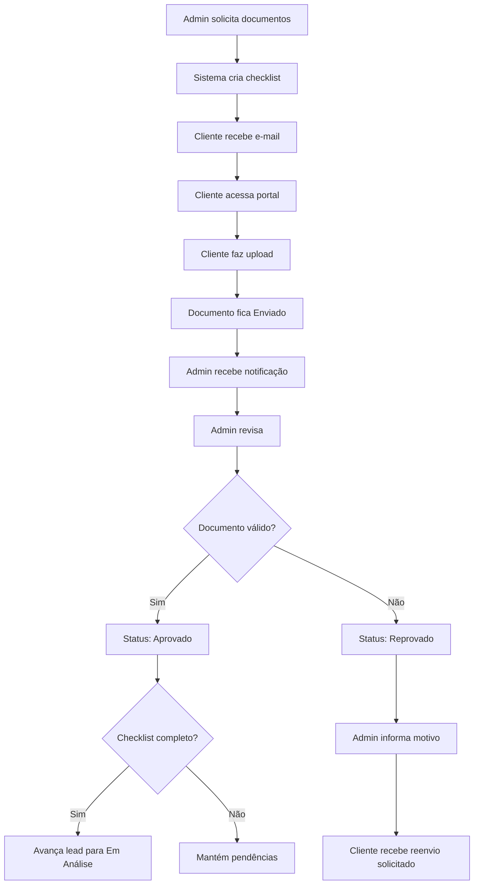

## 9. Notificação por e-mail

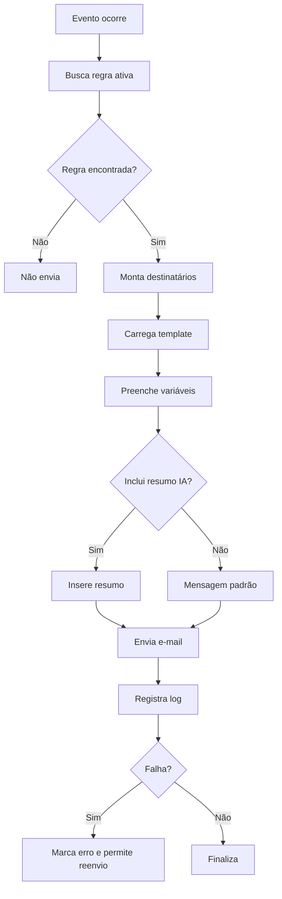

## 10. Relatório IA

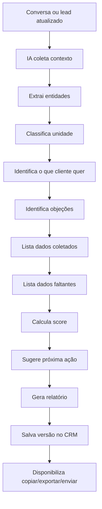

## 11. Desqualificação

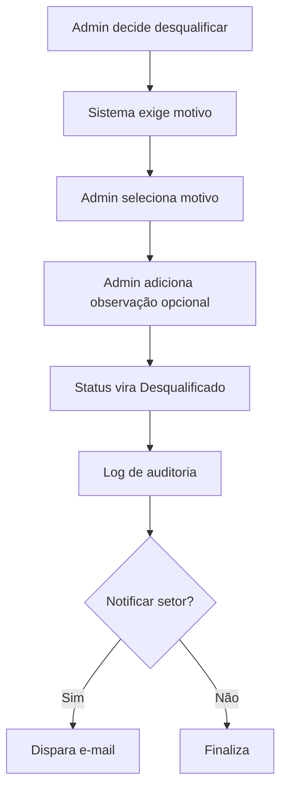
