<!-- BEGIN 00_README.md -->

# TradeK OS — Pacote de MDS

**Versão:** v0.1  
**Data:** 2026-06-14  
**Produto:** Site público + Agente IA + CRM interno + Painel Administrativo + Área do Cliente

## Objetivo

Este pacote transforma o briefing da TradeK em documentação de produto e especificação em Markdown para orientar design, desenvolvimento e implantação do **TradeK OS**.

A solução proposta é uma plataforma modular com:

- Site público responsivo.
- Botão flutuante do Agente TradeK no site.
- Qualificação automática com IA.
- CRM interno com visão Kanban e lista.
- Painel administrativo completo.
- Área do cliente com login, envio de documentos e chat.
- Relatórios automáticos do que o cliente quer, não quer, dados faltantes e próxima ação.
- Notificações por e-mail configuráveis por evento, unidade e status.
- Base RAG para alimentar os agentes.
- Cadastro dinâmico de produtos e serviços.

## Arquivos

| Arquivo | Conteúdo |
|---|---|
| `01_PRD_TradeK_OS.md` | Visão do produto, escopo, personas, objetivos, métricas e MVPs. |
| `02_SPEC_FUNCIONAL_TECNICA.md` | Requisitos funcionais, arquitetura, permissões, segurança e integrações. |
| `03_SPEC_SITE_PUBLICO_E_AGENTE.md` | Telas do site público, widget IA, formulário e jornada de captação. |
| `04_SPEC_PAINEL_ADMIN_TELAS.md` | Telas do painel administrativo: dashboard, CRM, modais, documentos, relatórios, configurações. |
| `05_SPEC_AREA_CLIENTE_TELAS.md` | Telas do portal do cliente: login, dashboard, documentos, ficha cadastral e chat. |
| `06_FLUXOS_OPERACIONAIS.md` | Fluxos em Mermaid: lead, IA, CRM, documentos, notificações, área do cliente e relatórios. |
| `07_CRM_DADOS_AUTOMACOES.md` | Status, modelo de dados, eventos, automações e regras de e-mail. |
| `08_AGENTES_IA_RAG_QUALIFICACAO.md` | Agentes de IA, perguntas por unidade, score, guardrails, RAG e handoff humano. |
| `09_CHECKLISTS_DOCUMENTOS.md` | Checklists por unidade, documentos obrigatórios, validações e mensagens padrão. |
| `10_PRODUTOS_MOTOS_CATALOGO.md` | Catálogo inicial de produtos extraído da planilha e regras de publicação/cotação. |
| `11_BACKLOG_ROADMAP_CRITERIOS.md` | MVPs, épicos, user stories, critérios de aceite e Definition of Done. |
| `12_RELATORIOS_TEMPLATES_EMAIL.md` | Relatórios IA e templates de e-mail configuráveis. |
| `13_WIREFRAMES_ASCII_TELAS_CHAVE.md` | Wireframes textuais das principais telas. |
| `14_FONTES_E_ASSUMPCOES.md` | Fontes, premissas e pontos a confirmar. |
| `TradeK_OS_SPEC_MASTER.md` | Versão consolidada com todos os arquivos acima. |

## Como usar

1. Use `01_PRD_TradeK_OS.md` para alinhamento de produto e escopo.
2. Use `03`, `04`, `05` e `13` para desenhar as telas no Figma.
3. Use `07`, `08` e `09` para orientar backend, IA, banco de dados e CRM.
4. Use `11` para quebrar o projeto em sprints.
5. Use `12` para configurar relatórios e e-mails.

## Decisão de produto

A recomendação é construir a solução como uma **plataforma operacional modular**, não como um simples site com painel. O site será a porta de entrada; o agente IA será o primeiro atendimento; o CRM será o núcleo interno; e a área do cliente será o canal seguro para continuidade, documentos e relacionamento.

<!-- END 00_README.md -->


<!-- BEGIN 01_PRD_TradeK_OS.md -->

# PRD — TradeK OS

**Versão:** v0.1  
**Data:** 2026-06-14  
**Produto:** TradeK OS — Plataforma de Gestão Comercial, IA e Operações Internacionais

## 1. Resumo executivo

O **TradeK OS** é uma plataforma digital para transformar a presença online da TradeK em um hub ativo de geração, qualificação e gestão de oportunidades comerciais.

A solução combina:

- Site público responsivo.
- Agente IA flutuante no site.
- Qualificação automática de leads.
- CRM interno com Kanban e lista.
- Painel administrativo.
- Área do cliente.
- Gestão documental.
- Relatórios comerciais e operacionais por IA.
- Notificações por e-mail configuráveis.
- Base de conhecimento/RAG.
- Cadastro de produtos e serviços.

## 2. Contexto

A TradeK atua em negócios internacionais, principalmente China/Brasil, com frentes como:

1. **Supply Chain Finance**.
2. **Procurement Internacional**.
3. **Motos Elétricas / Produtos**.
4. **Suporte à importação e orientação operacional**.

O material operacional descreve uma operação de Supply Chain Finance com análise documental, avaliação bancária, pagamento ao fornecedor na Ásia, prazo estendido de 90 a 180 dias, possibilidade de financiamento de até 100% do FOB e necessidade de RADAR/Siscomex para importação.

## 3. Problema

Os contatos comerciais podem chegar por site, formulário, chat, WhatsApp, indicação ou cadastro manual. Sem uma plataforma central, a equipe pode ter:

- Leads incompletos.
- Falta de priorização.
- Perda de histórico.
- Documentos espalhados.
- Retrabalho de cadastro.
- Notificações manuais.
- Baixa visibilidade do funil.
- Dificuldade para saber o que o cliente quer, não quer e o que falta para avançar.

## 4. Objetivos

### Objetivos de negócio

- Aumentar volume de oportunidades qualificadas.
- Reduzir tempo entre primeiro contato e ação comercial.
- Centralizar informações de leads, empresas e clientes.
- Organizar documentação e comunicação.
- Aumentar previsibilidade do funil.
- Criar base escalável para novas unidades e produtos.

### Objetivos do usuário visitante

- Entender rapidamente os serviços.
- Conversar com o Agente TradeK.
- Informar dados de forma simples.
- Receber direcionamento claro.

### Objetivos do administrador

- Visualizar todos os leads.
- Gerenciar oportunidades em Kanban e lista.
- Qualificar, desqualificar, atribuir e mover status.
- Criar acesso do cliente.
- Solicitar documentos.
- Gerar relatórios.
- Configurar e-mails de notificação.

### Objetivos do cliente logado

- Acessar portal seguro.
- Enviar documentos.
- Preencher ficha cadastral.
- Conversar com a TradeK.
- Acompanhar pendências e status geral.

## 5. Personas

### Importador brasileiro

Empresa que busca importar da China/Ásia com prazo de pagamento, preservação de capital de giro e apoio operacional.

### Empresa buscando fornecedor

Empresa que precisa encontrar, validar ou negociar com fornecedores chineses.

### Distribuidor/revendedor de produtos ou motos

Empresa interessada em comprar, importar, distribuir ou revender produtos representados pela TradeK.

### Administrador comercial

Usuário interno que gerencia funil, oportunidades, tarefas e relacionamento.

### Administrador operacional/financeiro

Usuário interno que analisa documentos, cadastro, importação, RADAR e viabilidade operacional.

### Cliente logado

Lead qualificado que recebeu acesso para enviar documentação e continuar o processo.

## 6. Proposta de valor

Para a TradeK, o produto centraliza captação, IA, CRM, documentos, relatórios e notificações. Para o cliente, torna o processo mais claro, organizado e seguro.

## 7. Escopo do produto

### Site público

- Home.
- Página Supply Chain Finance.
- Página Procurement.
- Página Motos/Produtos.
- Sobre.
- FAQ.
- Contato.
- Widget IA.
- Formulário fallback.
- Página de obrigado.

### Painel administrativo

- Dashboard executivo.
- CRM Kanban.
- CRM lista.
- Modal de lead.
- Central de interações.
- Relatórios IA.
- Empresas e contatos.
- Clientes e acessos.
- Documentos.
- Produtos e serviços.
- Propostas.
- Tarefas/SLA.
- Chat.
- Notificações.
- Templates.
- Agentes IA.
- Base RAG.
- Usuários e permissões.
- Auditoria.

### Área do cliente

- Login.
- Primeiro acesso.
- Dashboard.
- Oportunidades.
- Checklist de documentos.
- Upload.
- Ficha cadastral.
- Chat.
- Notificações.
- Perfil.

## 8. Fora do MVP inicial

- Aprovação automática de crédito.
- Integração bancária real.
- Cálculo automático de impostos/frete.
- Portal de fornecedor chinês.
- Assinatura digital integrada.
- E-commerce transacional.
- Cotação definitiva sem validação humana.
- Integração direta com Siscomex.
- Motor financeiro complexo.

## 9. Métricas de sucesso

### Comerciais

- Leads captados por período.
- Leads por unidade.
- Taxa de qualificação.
- Conversão por etapa.
- Tempo até primeiro contato humano.
- Valor estimado por pipeline.
- Motivos de perda/desqualificação.

### Operacionais

- Documentos solicitados.
- Documentos enviados.
- Tempo médio de revisão documental.
- Pendências por oportunidade.
- Clientes com checklist completo.
- SLA por responsável.

### IA

- Conversas iniciadas.
- Conversas concluídas.
- Leads criados pela IA.
- Percentual de leads com dados mínimos.
- Score médio por unidade.
- Handoffs para humano.
- Falhas de classificação.

## 10. Estratégia de MVP

### MVP 1 — Captação + CRM

- Site com agente IA.
- Formulário fallback.
- CRM Kanban e lista.
- Modal de lead.
- Relatório IA.
- Notificação por e-mail.
- Dashboard básico.
- Cadastro manual.
- Usuários admin.

### MVP 2 — Cliente + documentos

- Criação de usuário cliente.
- Convite por e-mail.
- Portal do cliente.
- Checklist documental.
- Upload.
- Chat admin-cliente.
- Aprovação/reprovação.

### MVP 3 — Avançado

- Produtos dinâmicos.
- Propostas/cotações.
- Relatórios gerenciais.
- RAG editável.
- Templates avançados.
- Tarefas/SLA.
- Auditoria completa.
- Integrações externas.

## 11. Requisitos críticos

1. O agente IA deve criar lead no CRM.
2. O admin deve visualizar leads em Kanban e lista.
3. Todo lead deve ter histórico.
4. Mudanças de status devem ser auditadas.
5. O admin deve poder criar acesso de cliente.
6. O cliente deve poder enviar documentos.
7. O admin deve aprovar/reprovar documentos.
8. A plataforma deve gerar relatório sobre o que o cliente quer, não quer, dados faltantes e próxima ação.
9. E-mails devem ser configuráveis por evento e unidade.
10. Cliente só pode ver seus próprios dados.

## 12. Riscos e mitigação

| Risco | Impacto | Mitigação |
|---|---:|---|
| IA prometer aprovação financeira | Alto | Guardrails e revisão humana. |
| Dados sensíveis expostos | Alto | Permissões, segregação e auditoria. |
| Documentos sem rastreabilidade | Alto | Versionamento e histórico. |
| Escopo grande | Médio | Entrega em MVPs. |
| Preços desatualizados | Médio | Controle de tabela aprovada. |
| E-mails enviados para setor errado | Médio | Regras configuráveis e log. |

<!-- END 01_PRD_TradeK_OS.md -->


<!-- BEGIN 02_SPEC_FUNCIONAL_TECNICA.md -->

# SPEC Funcional e Técnica — TradeK OS

## 1. Visão técnica

O TradeK OS deve ser uma aplicação web modular composta por:

```text
Site público
↓
Agente IA / Formulários
↓
Backend de captação
↓
CRM interno
↓
Painel administrativo
↓
Área do cliente
↓
Documentos, relatórios, notificações e auditoria
```

## 2. Módulos

### M01 — Site público

Apresenta a TradeK, unidades de negócio, serviços, produtos e CTAs de captação.

### M02 — Agente IA

Conversa com visitantes, coleta dados, classifica intenção, calcula score, cria lead e gera relatório.

### M03 — CRM interno

Gerencia leads/oportunidades com Kanban, lista, status, responsáveis, atividades e histórico.

### M04 — Painel administrativo

Opera dashboard, CRM, documentos, clientes, relatórios, produtos, serviços, configurações e auditoria.

### M05 — Área do cliente

Permite envio de documentos, ficha cadastral, chat e acompanhamento simplificado.

### M06 — Gestão documental

Controla checklist, upload, aprovação, reprovação, reenvio e versionamento.

### M07 — Relatórios IA

Gera resumos comerciais, operacionais e gerenciais.

### M08 — Notificações

Dispara e-mails configuráveis por evento, unidade, status e responsável.

### M09 — RAG / Base de conhecimento

Alimenta agentes com materiais institucionais, operacionais, técnicos e comerciais.

### M10 — Produtos e serviços

Gerencia catálogo, fichas técnicas, status comercial e regras de cotação pela IA.

## 3. Perfis e permissões

| Perfil | Descrição |
|---|---|
| Administrador Master | Acesso total. |
| Gerente Comercial | CRM, relatórios, pipeline e gestão comercial. |
| Comercial | Leads, contatos, tarefas, propostas e mensagens. |
| Operacional | Documentos, análise e status operacionais. |
| Financeiro | Dados financeiros, documentos e análise de operação. |
| Atendimento | Interações e suporte inicial. |
| Somente leitura | Consulta sem edição. |
| Cliente | Portal externo restrito aos próprios dados. |

## 4. Requisitos funcionais

### RF-001 — Captura de lead via agente IA

O visitante deve poder conversar com o agente no site. Ao final, o sistema cria ou atualiza lead no CRM.

**Aceite:** lead com nome, contato, unidade, origem, resumo IA, score e status.

### RF-002 — Formulário fallback

O site deve ter formulário tradicional para quem não quiser usar IA.

**Aceite:** formulário cria lead no CRM, com consentimento registrado.

### RF-003 — Classificação automática

A IA deve classificar o lead em Supply Chain Finance, Procurement, Produtos/Motos ou Suporte/Outro.

**Aceite:** unidade exibida no card, lista e modal; admin pode corrigir.

### RF-004 — Score IA

A IA calcula score de 0 a 100.

**Aceite:** score visível no card, lista e aba de qualificação; critérios exibidos.

### RF-005 — CRM Kanban

Admin visualiza e move oportunidades por etapa.

**Aceite:** drag and drop muda status, gera log e dispara automações.

### RF-006 — CRM lista

Admin visualiza oportunidades em tabela filtrável.

**Aceite:** busca, filtros, ordenação, exportação e ações em massa.

### RF-007 — Modal de detalhe

Admin abre lead em modal/tela dedicada.

**Aceite:** abas de resumo, dados, oportunidade, qualificação, interações, documentos, chat, relatório e histórico.

### RF-008 — Criação de usuário cliente

Admin cria acesso do cliente a partir de um lead qualificado.

**Aceite:** usuário vinculado à empresa e oportunidade; convite por e-mail; checklist associado.

### RF-009 — Portal do cliente

Cliente acessa ambiente restrito.

**Aceite:** vê apenas suas oportunidades, documentos e mensagens.

### RF-010 — Checklist documental

Admin solicita documentos por checklist padrão ou personalizado.

**Aceite:** cliente envia arquivos; admin aprova/reprova; reenvio tem histórico.

### RF-011 — Chat admin-cliente

Sistema permite mensagens por oportunidade.

**Aceite:** mensagens visíveis ao cliente separadas de comentários internos.

### RF-012 — Relatório IA

Sistema gera relatório automático do lead.

**Aceite:** relatório contém o que quer, o que não quer, dados coletados, dados faltantes, score e próxima ação.

### RF-013 — Notificações configuráveis

Admin Master configura e-mails por evento e unidade.

**Aceite:** aceita múltiplos e-mails, CC/BCC, template, ativo/inativo e log.

### RF-014 — Cadastro de produtos

Admin gerencia produtos e publicação no site.

**Aceite:** produto tem status, ficha técnica, preço base, publicação e regra de cotação IA.

### RF-015 — Base RAG

Admin alimenta conhecimento dos agentes.

**Aceite:** upload, categoria, unidade, status ativo/inativo e teste de resposta.

## 5. Requisitos não funcionais

### RNF-001 — Responsividade

Site, painel e portal devem funcionar em desktop e mobile. O painel pode priorizar desktop, mas deve ser utilizável em tablet.

### RNF-002 — Segurança

- Autenticação segura.
- Hash de senha.
- Sessão com expiração.
- Controle por perfil.
- Segregação admin/cliente.
- Logs de ações críticas.

### RNF-003 — LGPD

- Consentimento de contato.
- Registro de origem e finalidade.
- Política de privacidade.
- Exportação/exclusão/anonymização sob demanda.
- Controle de retenção documental.

### RNF-004 — Performance

- Site rápido.
- Filtros de CRM responsivos.
- Upload assíncrono.
- Tabelas paginadas.

### RNF-005 — Auditabilidade

Auditar login, criação de lead, mudança de status, criação de cliente, upload, revisão de documento, envio de e-mail e configurações.

### RNF-006 — Escalabilidade

Permitir novas unidades, agentes, produtos, checklists e templates sem refatoração pesada.

## 6. Arquitetura sugerida

### Frontend

- Site público.
- Painel admin.
- Portal cliente.
- Design system compartilhado.
- Componentes: cards, Kanban, tabela, modal, chat, uploader, timeline, filtros.

### Backend

Serviços/API para:

- Leads.
- Empresas.
- Contatos.
- Documentos.
- Interações.
- Relatórios.
- Notificações.
- Usuários.
- Permissões.
- Produtos.
- Agentes.

### Banco de dados

Tabelas principais:

- `users`
- `roles`
- `companies`
- `contacts`
- `leads`
- `opportunities`
- `interactions`
- `documents`
- `document_checklists`
- `reports`
- `products`
- `services`
- `notification_rules`
- `email_templates`
- `audit_logs`
- `agent_configs`
- `rag_documents`

### Storage de arquivos

- URL privada.
- Link temporário assinado.
- Versionamento por documento.
- Validação de tipo e tamanho.

### IA

Camada de orquestração com ferramentas para:

- Criar lead.
- Atualizar lead.
- Consultar produto.
- Gerar relatório.
- Solicitar checklist.
- Encaminhar para humano.

## 7. Integrações

### Essenciais

- E-mail transacional.
- Storage.
- IA/LLM.
- Banco de dados.
- Autenticação.

### Futuras

- WhatsApp.
- CRM externo/Notion.
- Google Drive.
- Assinatura digital.
- ERP.
- BI.

## 8. Guardrails de IA

A IA não pode:

- Aprovar crédito.
- Garantir financiamento.
- Garantir prazo.
- Inventar preço.
- Aprovar documentação.
- Emitir parecer jurídico/fiscal definitivo.

A IA pode:

- Explicar serviços.
- Coletar dados.
- Classificar intenção.
- Gerar score.
- Criar lead.
- Gerar relatório.
- Sugerir próximos passos.

<!-- END 02_SPEC_FUNCIONAL_TECNICA.md -->


<!-- BEGIN 03_SPEC_SITE_PUBLICO_E_AGENTE.md -->

# SPEC de Telas — Site Público e Agente IA

## 1. Jornada pública

```text
Visitante acessa o site
↓
Entende soluções TradeK
↓
Escolhe unidade ou abre Agente TradeK
↓
IA coleta informações
↓
Lead entra no CRM
↓
Equipe recebe relatório e notificação
```

## 2. Sitemap

```text
Home
├── Supply Chain Finance
├── Procurement Internacional
├── Motos / Produtos
├── Sobre
├── FAQ
├── Contato
└── Obrigado
```

## 3. SITE-01 — Home

### Objetivo

Apresentar a TradeK como hub de negócios internacionais e direcionar o usuário para uma unidade.

### Hero

**Headline:** TradeK: negócios internacionais com inteligência, segurança e escala.

**Subheadline:** Conectamos empresas brasileiras a soluções de importação, Supply Chain Finance, Procurement Internacional e oportunidades em produtos e mobilidade elétrica.

### CTAs

- `Falar com agente TradeK`
- `Conhecer soluções`
- `Solicitar análise`

### Seções

1. Hero.
2. Cards de unidades.
3. Como a TradeK ajuda.
4. Benefícios.
5. Atendimento com IA.
6. FAQ resumido.
7. Rodapé.

### Cards

- Supply Chain Finance.
- Procurement Internacional.
- Motos / Produtos.

Cada card deve abrir a página da unidade ou o agente já contextualizado.

## 4. SITE-02 — Supply Chain Finance

### Objetivo

Explicar a solução de compra/importação a prazo.

### Conteúdo

- Importação da China com prazo.
- Preservação de capital de giro.
- Pagamento direto ao fornecedor.
- Financiamento de até 100% do FOB, sujeito à análise.
- Prazo de 90 a 180 dias, sujeito à aprovação.
- Necessidade de RADAR/Siscomex.
- Análise documental.
- Apoio em cadastro e operação.

### Estrutura

1. Hero.
2. O desafio da importação tradicional.
3. Como funciona a solução TradeK.
4. Benefícios.
5. TradeK x operação padrão.
6. RADAR/Siscomex.
7. Documentos iniciais.
8. FAQ.
9. CTA do agente.

### CTA

- `Avaliar minha importação`
- `Entender documentos necessários`

### Compliance

Toda condição comercial deve aparecer com ressalva:

```text
Sujeito à análise cadastral, documental, financeira e aprovação da linha de crédito.
```

## 5. SITE-03 — Procurement Internacional

### Objetivo

Apresentar busca, validação e negociação com fornecedores internacionais.

### Estrutura

1. Hero.
2. O que é Procurement Internacional.
3. Etapas do processo.
4. Dados necessários para briefing.
5. Benefícios.
6. CTA para agente.

### Dados para briefing

- Produto.
- Especificações.
- Volume.
- Orçamento-alvo.
- Prazo.
- Certificações.
- Mercado de destino.
- Referências.
- Amostra/inspeção.

## 6. SITE-04 — Motos / Produtos

### Objetivo

Apresentar catálogo e captar interessados em compra, importação, revenda ou distribuição.

### Estrutura

1. Hero.
2. Catálogo.
3. Cards de modelos.
4. Comparativo.
5. Ficha técnica.
6. Importação/homologação.
7. Solicitação de proposta.

### Regra

Produtos vêm do painel admin. O site não deve conter ficha técnica fixa no código.

## 7. SITE-05 — FAQ

### Supply Chain Finance

- Preciso ter experiência em importação?
- Preciso ter RADAR?
- O prazo é garantido?
- O financiamento é aprovado automaticamente?
- Quais documentos são necessários?
- A TradeK escolhe o fornecedor?

### Procurement

- Vocês encontram fornecedor do zero?
- Vocês fazem inspeção?
- É possível pedir amostra?
- Quanto tempo leva o sourcing?
- Preciso ter especificação técnica?

### Produtos/Motos

- Quais modelos estão disponíveis?
- Existe quantidade mínima?
- Posso ser distribuidor?
- Precisa homologação?
- A proposta é automática?

## 8. SITE-06 — Contato

### Campos

- Nome.
- Empresa.
- CNPJ.
- E-mail.
- WhatsApp.
- Unidade de interesse.
- Mensagem.
- Consentimento LGPD.

### Ação

Cria lead com origem `formulario_site`.

## 9. SITE-07 — Obrigado

### Mensagem

```text
Recebemos sua solicitação.
A equipe TradeK irá analisar os dados enviados e retornar com o próximo passo.
Se necessário, você poderá receber um convite para acessar o portal do cliente e enviar documentos complementares.
```

## 10. Componente — Botão flutuante do Agente TradeK

### Posição

- Desktop: canto inferior direito.
- Mobile: canto inferior direito ou barra inferior.

### Estados

1. Fechado.
2. Aberto.
3. Minimizado.
4. Nova mensagem.
5. Finalizado.
6. Handoff humano.

### Primeira mensagem

```text
Olá, sou o agente virtual da TradeK.
Posso ajudar com importação, financiamento, fornecedores ou produtos.
```

### Botões rápidos

- `Importar com prazo`
- `Encontrar fornecedor`
- `Motos / Produtos`
- `Já sou cliente`
- `Outro assunto`

## 11. Janela do chat IA

### Dados mínimos

- Nome.
- Empresa.
- CNPJ.
- E-mail.
- WhatsApp.
- Unidade.
- Demanda.
- Valor/volume/quantidade.
- Urgência.
- Consentimento.

### Regras

- Não perguntar tudo de uma vez.
- Coletar por blocos.
- Confirmar dados antes de finalizar.
- Criar lead mesmo com dados incompletos.
- Handoff para humano quando houver pedido de proposta, preço final, aprovação financeira, reclamação ou análise sensível.

## 12. Eventos do site

| Evento | Descrição | Ação |
|---|---|---|
| `chat.opened` | Visitante abriu chat | Registrar sessão. |
| `chat.started` | Primeira mensagem | Criar interação. |
| `lead.partial_created` | Dados parciais | Criar lead parcial. |
| `lead.created` | Dados mínimos | Criar lead. |
| `lead.qualified` | Score mínimo | Notificar admin. |
| `form.submitted` | Formulário enviado | Criar lead. |
| `page.cta_clicked` | CTA clicado | Registrar origem. |

<!-- END 03_SPEC_SITE_PUBLICO_E_AGENTE.md -->


<!-- BEGIN 04_SPEC_PAINEL_ADMIN_TELAS.md -->

# SPEC de Telas — Painel Administrativo

## 1. Conceito

O painel administrativo é o centro operacional da TradeK. Ele combina dashboard, CRM, interações, documentos, clientes, relatórios, produtos, serviços, notificações, IA e configurações.

## 2. Menu lateral

```text
Dashboard
CRM
Interações
Relatórios IA
Empresas & Contatos
Clientes
Documentos
Produtos & Serviços
Cotações / Propostas
Tarefas
Chat
Notificações
Usuários
Configurações
Auditoria
```

## 3. ADM-01 — Login Administrativo

### Objetivo

Acesso seguro dos usuários internos.

### Componentes

- Logo TradeK.
- E-mail.
- Senha.
- Esqueci senha.
- Entrar.
- Opcional: 2FA.

### Regras

- Cliente não acessa por esta tela.
- Tentativas inválidas geram log.
- Sessão expira após inatividade.
- Usuário bloqueado não entra.

## 4. ADM-02 — Dashboard Executivo

### Objetivo

Apresentar visão gerencial do funil, agentes, documentos e pendências.

### KPIs

- Leads novos hoje.
- Leads no mês.
- Leads qualificados.
- Taxa de qualificação.
- Leads por unidade.
- Leads por origem.
- Conversas iniciadas.
- Conversas concluídas.
- Tempo médio de resposta.
- Leads sem responsável.
- Documentos pendentes.
- Propostas enviadas.
- Ganhos.

### Blocos

1. Cards de KPIs.
2. Funil por status.
3. Leads por unidade.
4. Performance de agentes.
5. Pendências críticas.
6. Últimas interações.
7. Tarefas vencidas.
8. Alertas de SLA.

### Ações

- Filtrar período.
- Filtrar unidade.
- Exportar relatório.
- Abrir CRM.
- Abrir leads sem responsável.
- Abrir documentos pendentes.

## 5. ADM-03 — CRM Kanban

### Objetivo

Gerenciar oportunidades visualmente por etapa.

### Colunas recomendadas

1. Novo Lead.
2. Em Qualificação.
3. Dados Incompletos.
4. Qualificado.
5. Documentos Solicitados.
6. Documentos Recebidos.
7. Em Análise.
8. Proposta.
9. Negociação.
10. Ganho.
11. Perdido/Desqualificado.

### Card do lead

Cada card deve mostrar:

- Empresa.
- Contato.
- Unidade.
- Score IA.
- Valor/volume estimado.
- Responsável.
- Última interação.
- Próxima ação.
- Pendência documental.
- Origem.
- Urgência.

### Ações rápidas

- Abrir detalhe.
- Mover status.
- Atribuir responsável.
- Solicitar documento.
- Criar acesso cliente.
- Gerar relatório.
- Desqualificar.
- Criar tarefa.
- Enviar e-mail.
- Abrir chat.

### Regras

- Drag and drop altera status.
- Alteração gera histórico.
- Desqualificar exige motivo.
- Ganho exige valor final ou observação.
- Mover para documentos solicitados pode abrir checklist.
- Mover para qualificado sugere criação de acesso cliente.

## 6. ADM-04 — CRM Lista

### Objetivo

Operação tabular, filtros avançados e exportação.

### Colunas

```text
ID
Data
Empresa
Contato
CNPJ
Unidade
Origem
Score IA
Status
Responsável
Valor estimado
Volume
Última interação
Próxima ação
Documentos pendentes
Cliente portal
```

### Filtros

- Unidade.
- Status.
- Responsável.
- Score mínimo/máximo.
- Origem.
- Data.
- Tem documentos pendentes.
- Tem cliente criado.
- Tem conversa IA.
- Desqualificado por motivo.
- Produto/serviço.

### Ações em massa

- Alterar status.
- Atribuir responsável.
- Enviar e-mail.
- Gerar relatório.
- Exportar.
- Arquivar.
- Criar tarefas.

## 7. ADM-05 — Modal de Detalhe do Lead

### Objetivo

Ser a tela principal de trabalho do comercial.

### Header

- Empresa.
- Contato.
- Status.
- Score.
- Unidade.
- Responsável.
- Botões: salvar, fechar, ações.

### Abas

1. Resumo.
2. Dados do lead.
3. Oportunidade.
4. Qualificação IA.
5. Interações.
6. Documentos.
7. Chat.
8. Relatório.
9. Histórico.

### Aba Resumo

- Resumo executivo IA.
- O que o cliente quer.
- O que o cliente não quer.
- Pendências.
- Próxima ação.
- Riscos.
- Botões rápidos.

### Aba Dados do lead

- Nome.
- Empresa.
- CNPJ.
- E-mail.
- WhatsApp.
- Cargo.
- Cidade/Estado.
- Origem.
- Consentimento LGPD.
- Tags.
- Responsável.

### Aba Oportunidade

Campos comuns:

- Unidade.
- Produto/serviço.
- Valor estimado.
- Volume/quantidade.
- Prazo.
- Urgência.
- Observações.
- Status.

Campos Supply Chain Finance:

- Produto importado.
- Valor FOB.
- Fornecedor.
- País de origem.
- Incoterm.
- Pedido negociado.
- Possui RADAR.
- Tipo de RADAR.
- Média de importações.
- Prazo desejado.
- Documentos disponíveis.
- Banco/seguradora em análise.
- Status da avaliação.

Campos Procurement:

- Categoria.
- Especificações.
- Volume.
- Orçamento-alvo.
- Prazo.
- Certificações.
- Mercado de destino.
- Amostra.
- Inspeção.
- Fornecedor atual.

Campos Produtos/Motos:

- Modelo.
- Quantidade.
- Perfil do comprador.
- Região.
- Canal de venda.
- Necessidade de homologação.
- Experiência em importação.
- Observações comerciais.

### Aba Qualificação IA

- Score total.
- Critérios pontuados.
- Dados faltantes.
- Classificação.
- Recomendações.
- Aprovar qualificação.
- Ajustar score.
- Desqualificar.

### Aba Interações

Timeline com:

- Conversa IA.
- Mensagens do cliente.
- Formulários.
- E-mails enviados.
- Mudanças de status.
- Comentários internos.
- Uploads.
- Relatórios gerados.

### Aba Documentos

- Checklist.
- Documentos solicitados.
- Status.
- Arquivos enviados.
- Versões.
- Aprovar/reprovar.
- Solicitar reenvio.
- Comentários.

### Aba Chat

- Mensagem ao cliente.
- Comentário interno.
- Anexo.
- Templates.
- Sugestão IA.

### Aba Relatório

- Visualizar relatório.
- Regenerar.
- Copiar.
- Exportar PDF.
- Enviar por e-mail.
- Ver versões anteriores.

## 8. ADM-06 — Novo Lead Manual

### Objetivo

Cadastrar oportunidades recebidas por telefone, e-mail, WhatsApp, indicação ou evento.

### Campos

- Nome.
- Empresa.
- CNPJ.
- E-mail.
- WhatsApp.
- Origem.
- Unidade.
- Produto/serviço.
- Valor/volume.
- Observação.
- Responsável.
- Status inicial.
- Tags.

### Pós-salvar

- Rodar qualificação IA.
- Criar relatório inicial.
- Criar tarefa.
- Notificar responsável.

## 9. ADM-07 — Central de Interações

### Objetivo

Concentrar conversas de IA, clientes e administradores.

### Layout

- Lista lateral de conversas.
- Painel central com mensagens.
- Painel direito com lead vinculado.

### Funcionalidades

- Assumir conversa.
- Transferir.
- Vincular a lead existente.
- Converter em lead.
- Marcar resolvida.
- Gerar resumo.
- Responder manualmente.
- Usar sugestão IA.

## 10. ADM-08 — Qualificação IA

### Objetivo

Mostrar detalhamento de pontuação e permitir revisão humana.

### Componentes

- Score.
- Classificação.
- Critérios.
- Dados coletados.
- Dados faltantes.
- Motivos de risco.
- Próxima ação.
- Botões de decisão.

### Decisões

- Aprovar qualificação.
- Solicitar mais informações.
- Solicitar documentos.
- Criar acesso cliente.
- Desqualificar.
- Recalcular score.

## 11. ADM-09 — Documentos e Checklists

### Objetivo

Gerenciar documentos de todos os clientes.

### Filtros

- Unidade.
- Cliente.
- Empresa.
- Status.
- Tipo.
- Vencimento.
- Responsável.

### Status

- Não solicitado.
- Solicitado.
- Enviado.
- Em revisão.
- Aprovado.
- Reprovado.
- Reenvio solicitado.
- Vencido.

## 12. ADM-10 — Empresas & Contatos

### Objetivo

Separar cadastro de empresa, contatos e oportunidades.

### Abas da empresa

- Dados.
- Contatos.
- Oportunidades.
- Documentos.
- Usuários.
- Histórico.

## 13. ADM-11 — Clientes / Acessos

### Objetivo

Gerenciar usuários externos.

### Colunas

- Cliente.
- Empresa.
- E-mail.
- Status acesso.
- Último login.
- Oportunidade vinculada.
- Checklist.
- Ações.

### Ações

- Criar usuário.
- Reenviar convite.
- Resetar senha.
- Bloquear.
- Revogar.
- Vincular oportunidade.
- Ver como cliente.

## 14. ADM-12 — Criar Acesso do Cliente

### Modal

- Nome.
- E-mail.
- Empresa.
- Oportunidade.
- Checklist.
- Mensagem opcional.
- Tipo de convite.

### Regras

- Padrão: convite seguro.
- Alternativa: senha temporária com troca obrigatória.
- Evento registrado no lead.
- E-mail disparado conforme template.

## 15. ADM-13 — Produtos & Serviços

### Produto

- Modelo.
- Categoria.
- Descrição.
- Motor.
- Velocidade.
- Autonomia.
- Bateria.
- Freios.
- Capacidade.
- MOQ.
- Preço base.
- Moeda.
- Condição.
- Imagens.
- Ficha técnica.
- Status.
- Publicar no site.
- Permitir cotação IA.

### Serviço

- Nome.
- Categoria.
- Descrição.
- Público-alvo.
- Perguntas de qualificação.
- Checklist padrão.
- Agente vinculado.
- E-mails notificados.
- Status.

## 16. ADM-14 — Cotações / Propostas

### Status

- Rascunho.
- Aguardando dados.
- Em validação.
- Enviada.
- Aceita.
- Recusada.
- Cancelada.

### Ações

- Gerar proposta.
- Anexar PDF.
- Enviar por e-mail.
- Registrar aceite.
- Registrar recusa.
- Vincular oportunidade.

## 17. ADM-15 — Relatórios IA

### Tipos

- Relatório do lead.
- Relatório comercial.
- Relatório operacional.
- Relatório gerencial.
- Relatório por período.
- Relatório por unidade.

### Funcionalidades

- Filtrar.
- Abrir.
- Regenerar.
- Exportar.
- Enviar.
- Comparar versões.

## 18. ADM-16 — Tarefas e SLA

### Campos

- Título.
- Lead.
- Responsável.
- Prazo.
- Prioridade.
- Status.
- Comentário.
- Checklist vinculado.

### Automações

- Criar tarefa para lead score alto.
- Criar follow-up após X dias sem resposta.
- Alertar tarefa vencida.
- Notificar responsável.

## 19. ADM-17 — Chat

### Tipos de mensagem

- Visível ao cliente.
- Interna.
- Automática.
- IA.
- E-mail registrado.

### Regra

Comentários internos nunca aparecem ao cliente.

## 20. ADM-18 — Notificações

### Eventos configuráveis

- Novo lead.
- Lead qualificado.
- Lead desqualificado.
- Mudança de status.
- Documento enviado.
- Documento aprovado.
- Documento reprovado.
- Nova mensagem.
- Relatório gerado.
- Proposta enviada.
- Lead ganho.
- Lead perdido.

### Campos

- Evento.
- Unidade.
- Status origem.
- Status destino.
- Para.
- CC.
- BCC.
- Template.
- Ativo.
- Enviar resumo IA.
- Enviar anexos.
- Frequência.

## 21. ADM-19 — Templates de E-mail

### Templates iniciais

- Novo lead recebido.
- Lead qualificado.
- Convite cliente.
- Solicitação de documentos.
- Documento recebido.
- Documento reprovado.
- Nova mensagem.
- Proposta enviada.
- Alteração de status.

### Variáveis

```text
{{nome_cliente}}
{{empresa}}
{{cnpj}}
{{unidade}}
{{status}}
{{score}}
{{resumo_ia}}
{{proxima_acao}}
{{link_portal}}
{{documentos_pendentes}}
{{responsavel}}
```

## 22. ADM-20 — Configuração dos Agentes IA

### Abas

- Agente Geral.
- Supply Chain Finance.
- Procurement.
- Produtos/Motos.
- Suporte.
- Regras.
- Base de conhecimento.

### Campos

- Nome.
- Avatar.
- Mensagem inicial.
- Unidade.
- Perguntas obrigatórias.
- Perguntas condicionais.
- Campos de saída.
- Score mínimo.
- Status inicial.
- Checklist acionado.
- Produtos consultáveis.
- Guardrails.

## 23. ADM-21 — Base RAG

### Funcionalidades

- Upload.
- Categoria.
- Unidade.
- Status ativo/inativo.
- Data de validade.
- Teste de resposta.
- Ver trechos recuperados.
- Versionar documento.

## 24. ADM-22 — Usuários e Permissões

### Funcionalidades

- Criar usuário.
- Definir perfil.
- Bloquear.
- Resetar senha.
- Ver último login.
- Permissões por módulo.

## 25. ADM-23 — Auditoria

### Campos do log

- Usuário.
- Ação.
- Entidade.
- Valor anterior.
- Novo valor.
- Data/hora.
- IP.
- Origem.

## 26. ADM-24 — Configurações Gerais

### Seções

- Empresa.
- Status do CRM.
- Unidades.
- Produtos.
- Serviços.
- Checklists.
- Notificações.
- Templates.
- Agentes.
- RAG.
- Segurança.
- LGPD.
- Integrações.

<!-- END 04_SPEC_PAINEL_ADMIN_TELAS.md -->


<!-- BEGIN 05_SPEC_AREA_CLIENTE_TELAS.md -->

# SPEC de Telas — Área do Cliente

## 1. Objetivo

A área do cliente permite que um lead qualificado continue o processo com segurança, enviando documentos, preenchendo ficha cadastral, recebendo solicitações e conversando com a equipe TradeK.

## 2. Princípios

- Cliente vê apenas seus próprios dados.
- Cliente não vê score interno.
- Cliente não vê comentários internos.
- Cliente não vê riscos comerciais ou análise financeira interna.
- Cliente tem uma visão simples: status, pendências, documentos e mensagens.
- Toda ação do cliente gera registro no admin.

## 3. CLI-01 — Login do Cliente

### Componentes

- Logo TradeK.
- E-mail.
- Senha.
- Entrar.
- Esqueci senha.
- Link para criar senha via convite.
- Política de privacidade.

### Regras

- Convite pode expirar.
- Primeiro acesso pode exigir troca de senha.
- Usuário bloqueado não entra.
- Tentativas inválidas geram log.

## 4. CLI-02 — Primeiro Acesso

### Fluxo

```text
Cliente clica no link
↓
Sistema valida token
↓
Cliente cria senha
↓
Aceita termos
↓
Acessa dashboard
```

### Campos

- Nova senha.
- Confirmar senha.
- Aceite de termos.
- Aceite de política de privacidade.

## 5. CLI-03 — Dashboard do Cliente

### Objetivo

Mostrar estado geral da solicitação.

### Componentes

- Saudação.
- Oportunidade principal.
- Status atual.
- Próximo passo.
- Documentos pendentes.
- Mensagens recentes.
- Botões de ação.

### Exemplo

```text
Olá, João.

Sua solicitação:
Supply Chain Finance — Importação da China

Status:
Documentos solicitados

Próximo passo:
Envie os documentos pendentes para análise.

Pendências:
[ ] Contrato Social
[ ] Cartão CNPJ
[ ] Comprovante de Endereço
[ ] RG/CPF Representante Legal
```

## 6. CLI-04 — Minhas Oportunidades

### Lista

- Unidade.
- Produto/serviço.
- Status.
- Última atualização.
- Próxima ação.
- Botão abrir.

### Status simplificados

| Status interno | Status visível ao cliente |
|---|---|
| Novo Lead | Solicitação recebida |
| Em Qualificação IA | Em triagem |
| Dados Incompletos | Aguardando informações |
| Qualificado | Em preparação |
| Documentos Solicitados | Documentos solicitados |
| Documentos Recebidos | Documentos recebidos |
| Em Análise | Em análise |
| Proposta Enviada | Proposta enviada |
| Em Negociação | Em negociação |
| Ganho | Concluído |
| Perdido/Desqualificado | Encerrado |

## 7. CLI-05 — Detalhe da Oportunidade

### Componentes

- Unidade.
- Status.
- Próximo passo.
- Dados principais.
- Checklist.
- Chat.
- Histórico simplificado.

### Dados exibidos

- Nome da empresa.
- CNPJ.
- Contato.
- Unidade.
- Produto/serviço.
- Prazo informado.
- Documentos pendentes.
- Mensagens.

### Dados ocultos

- Score IA.
- Classificação interna.
- Comentários internos.
- Motivos de risco.
- Parecer de análise.
- E-mails internos.
- Outros clientes.

## 8. CLI-06 — Checklist de Documentos

### Item do checklist

- Nome do documento.
- Status.
- Descrição.
- Formatos aceitos.
- Botão enviar.
- Histórico de versões.
- Motivo de reprovação, se houver.

### Status

- Pendente.
- Enviado.
- Em revisão.
- Aprovado.
- Reprovado.
- Reenvio solicitado.

### Regras

- Cliente pode reenviar documento reprovado.
- Documento aprovado não deve ser substituído sem autorização.
- Cada upload notifica admin.
- Admin vê versões anteriores.
- Upload deve ter limite de tamanho e tipo.

## 9. CLI-07 — Upload de Documentos

### Campos

- Tipo de documento.
- Arquivo.
- Observação opcional.
- Confirmação de envio.

### Tipos aceitos

- PDF.
- JPG.
- PNG.
- DOCX.
- XLSX.

### Regras

- Validar extensão.
- Validar tamanho.
- Gerar hash/registro do arquivo.
- Salvar data/hora.
- Atualizar status.
- Notificar e-mails configurados.

## 10. CLI-08 — Ficha Cadastral

### Seções

1. Dados da empresa.
2. Importações.
3. Endereço comercial.
4. Contato.
5. Representante legal.
6. Dados bancários.
7. Referências comerciais.

### Funcionalidades

- Salvar rascunho.
- Enviar para análise.
- Validação de obrigatórios.
- Máscara de CNPJ, CPF, CEP e telefone.
- Campo “não se aplica” quando permitido.

### Campos principais

#### Dados da empresa

- Razão social.
- Nome fantasia.
- CNPJ.
- Inscrição estadual.
- Inscrição municipal.
- Data de fundação.
- CNAE principal.
- CNAE secundário.

#### Importações

- Possui RADAR?
- Tipo de RADAR.
- Média de importações.
- Produtos importados.
- Países de origem.

#### Endereço

- Rua/avenida.
- Número.
- Complemento.
- Bairro.
- Cidade.
- Estado.
- CEP.

#### Contato

- Telefone fixo.
- Celular/WhatsApp.
- E-mail principal.
- E-mail secundário.
- Site.

#### Representante legal

- Nome.
- CPF.
- Cargo.
- E-mail.
- Telefone.

#### Dados bancários

- Banco principal.
- Agência.
- Conta.
- Tempo de conta.
- Banco secundário.
- Agência.
- Conta.
- Tempo de conta.

#### Referências comerciais

- Empresa 1.
- Telefone 1.
- Empresa 2.
- Telefone 2.

## 11. CLI-09 — Chat com TradeK

### Funcionalidades

- Enviar mensagem.
- Anexar arquivo.
- Ver resposta.
- Receber notificação.
- Ver histórico.
- Marcar como resolvido.

### Regras

- Cliente não vê comentários internos.
- Admin pode transformar mensagem em tarefa.
- Admin pode vincular documento enviado pelo chat ao checklist.

## 12. CLI-10 — Notificações

### Eventos exibidos

- Documento solicitado.
- Documento enviado.
- Documento aprovado.
- Documento reprovado.
- Nova mensagem.
- Status alterado.
- Proposta enviada.
- Pendência criada.

### Campos

- Data/hora.
- Tipo.
- Mensagem.
- Link relacionado.
- Lida/não lida.

## 13. CLI-11 — Perfil e Segurança

### Funcionalidades

- Alterar senha.
- Atualizar telefone.
- Ver e-mail de acesso.
- Sair.
- Solicitar suporte.
- Solicitar exclusão/privacidade, se aplicável.

<!-- END 05_SPEC_AREA_CLIENTE_TELAS.md -->


<!-- BEGIN 06_FLUXOS_OPERACIONAIS.md -->

# Fluxos Operacionais — TradeK OS

## 1. Captação e qualificação geral

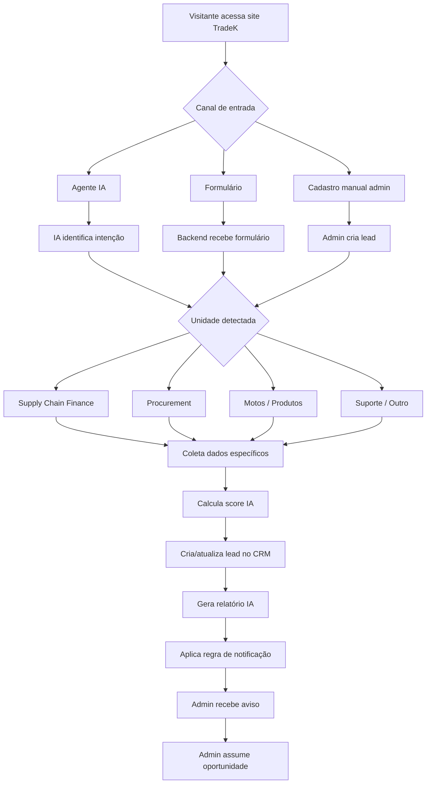

## 2. Agente IA no site

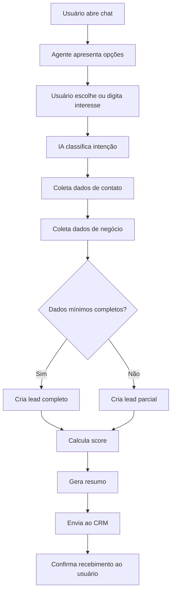

## 3. Supply Chain Finance

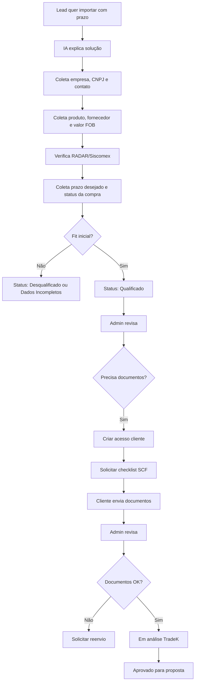

## 4. Procurement

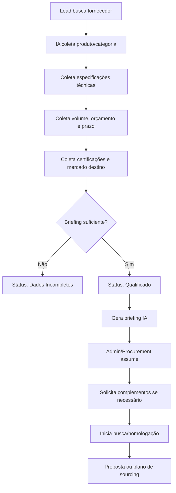

## 5. Motos / Produtos

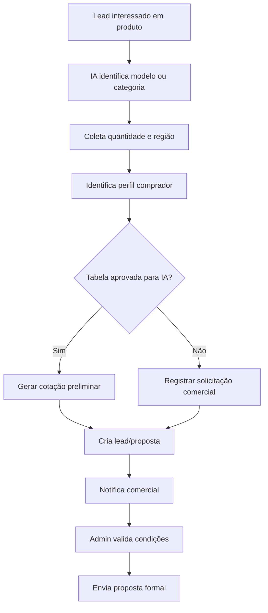

## 6. Status do CRM

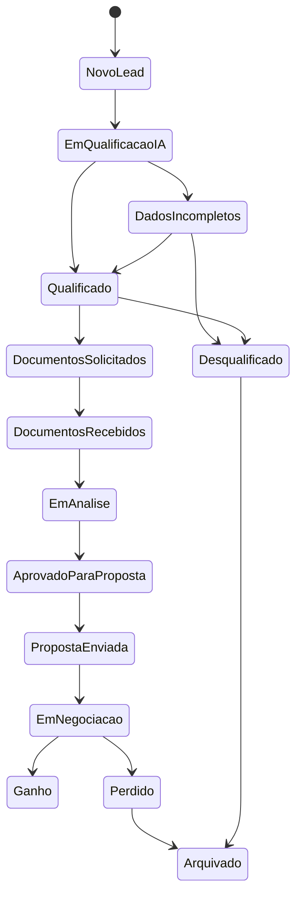

## 7. Criação de usuário cliente

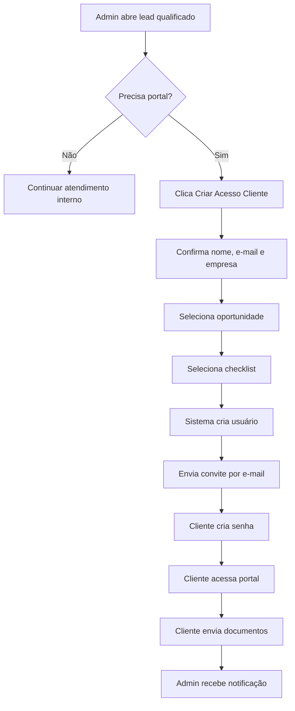

## 8. Documentos

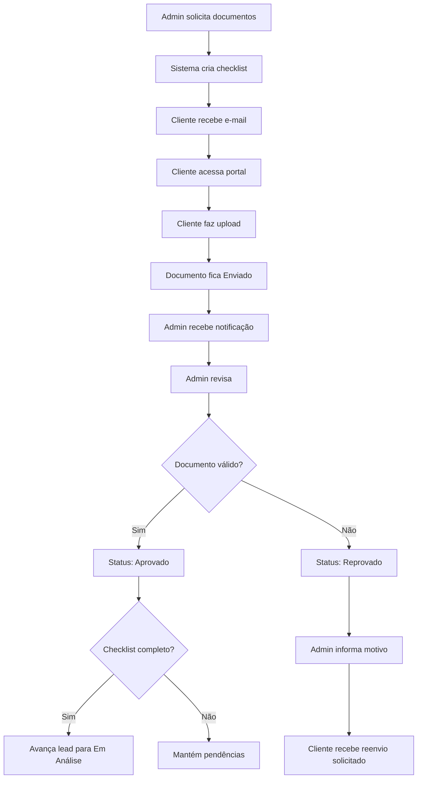

## 9. Notificação por e-mail

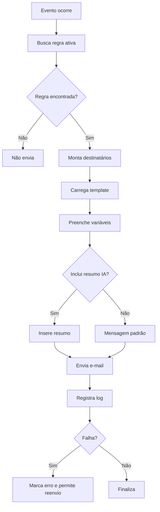

## 10. Relatório IA

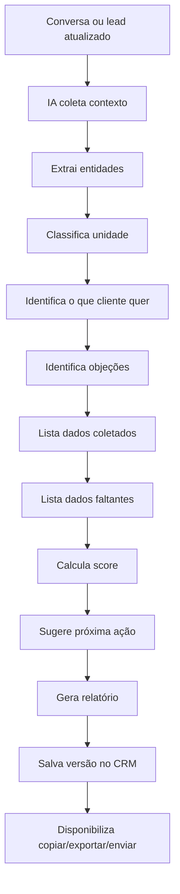

## 11. Desqualificação

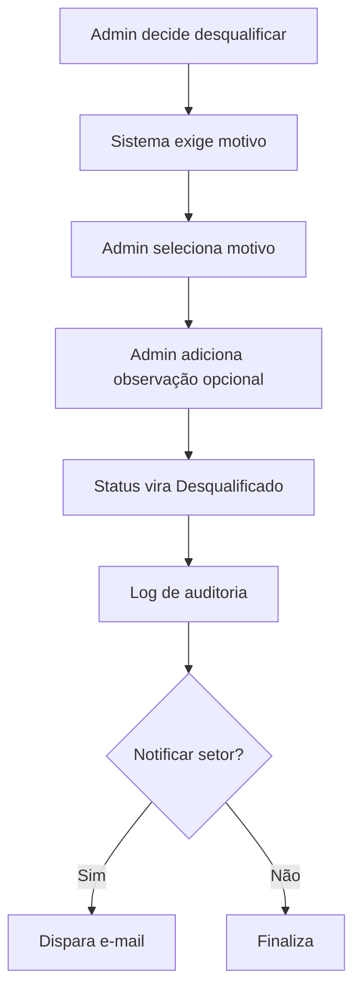

<!-- END 06_FLUXOS_OPERACIONAIS.md -->


<!-- BEGIN 07_CRM_DADOS_AUTOMACOES.md -->

# CRM, Dados, Status e Automações — TradeK OS

## 1. Pipeline recomendado

```text
Novo Lead
Em Qualificação IA
Dados Incompletos
Qualificado
Documentos Solicitados
Documentos Recebidos
Em Análise TradeK
Aprovado para Proposta
Proposta Enviada
Em Negociação
Ganho
Perdido
Desqualificado
Arquivado
```

## 2. Definição dos status

| Status | Definição | Próxima ação típica |
|---|---|---|
| Novo Lead | Lead acabou de entrar. | IA/admin inicia qualificação. |
| Em Qualificação IA | IA coleta ou processa dados. | Completar dados mínimos. |
| Dados Incompletos | Faltam dados críticos. | Solicitar informações. |
| Qualificado | Tem fit inicial e dados mínimos. | Admin assumir. |
| Documentos Solicitados | Checklist enviado ao cliente. | Aguardar upload. |
| Documentos Recebidos | Cliente enviou documentos. | Revisar. |
| Em Análise TradeK | Equipe analisa dados/documentos. | Aprovar, pedir complemento ou reprovar. |
| Aprovado para Proposta | Pode receber proposta. | Gerar proposta. |
| Proposta Enviada | Proposta encaminhada. | Follow-up. |
| Em Negociação | Tratativa ativa. | Negociar. |
| Ganho | Negócio fechado. | Encerrar/operacionalizar. |
| Perdido | Oportunidade perdida. | Registrar motivo. |
| Desqualificado | Não possui fit. | Arquivar ou nutrir. |
| Arquivado | Sem ação ativa. | Manter histórico. |

## 3. Entidades de dados

### Lead / Oportunidade

```yaml
lead:
  id: uuid
  data_criacao: datetime
  origem: enum
  unidade: enum
  status: enum
  score_ia: integer
  classificacao: enum
  responsavel_id: uuid
  empresa_id: uuid
  contato_id: uuid
  produto_servico_interesse: string
  valor_estimado: decimal
  moeda_valor_estimado: string
  volume_estimado: string
  prazo_desejado: string
  urgencia: enum
  resumo_ia: text
  o_que_cliente_quer: text
  o_que_cliente_nao_quer: text
  dados_coletados: json
  dados_faltantes: json
  pendencias: json
  riscos: json
  proxima_acao: text
  motivo_desqualificacao: enum
  motivo_perda: enum
  tags: array
  ultimo_contato_em: datetime
  proxima_tarefa_em: datetime
  cliente_portal_criado: boolean
  consentimento_lgpd: boolean
```

### Empresa

```yaml
empresa:
  id: uuid
  razao_social: string
  nome_fantasia: string
  cnpj: string
  inscricao_estadual: string
  inscricao_municipal: string
  data_fundacao: date
  cnae_principal: string
  cnae_secundario: string
  possui_radar: boolean
  tipo_radar: enum
  media_importacoes: string
  endereco: object
  site: string
  observacoes: text
```

### Contato

```yaml
contato:
  id: uuid
  empresa_id: uuid
  nome: string
  cargo: string
  email: string
  telefone: string
  whatsapp: string
  cpf_opcional: string
  tipo: enum
  principal: boolean
```

### Documento

```yaml
documento:
  id: uuid
  empresa_id: uuid
  lead_id: uuid
  cliente_id: uuid
  tipo_documento: enum
  nome_original: string
  arquivo_url: string
  storage_key: string
  status: enum
  versao: integer
  enviado_em: datetime
  revisado_em: datetime
  revisado_por: uuid
  motivo_reprovacao: text
  observacoes: text
  hash_arquivo: string
```

### Checklist

```yaml
checklist:
  id: uuid
  nome: string
  unidade: enum
  ativo: boolean
  itens:
    - tipo_documento: enum
      obrigatorio: boolean
      descricao: text
      formatos_aceitos: array
```

### Interação

```yaml
interacao:
  id: uuid
  lead_id: uuid
  canal: enum
  tipo: enum
  autor_tipo: enum
  autor_id: uuid
  mensagem: text
  anexos: array
  visivel_cliente: boolean
  criado_em: datetime
```

### Relatório IA

```yaml
relatorio_ia:
  id: uuid
  lead_id: uuid
  tipo: enum
  conteudo: markdown
  score: integer
  modelo_ia: string
  prompt_version: string
  gerado_em: datetime
  gerado_por: enum
  enviado_por_email: boolean
  versao: integer
```

### Produto

```yaml
produto:
  id: uuid
  modelo: string
  categoria: string
  descricao_curta: text
  descricao_completa: text
  motor: string
  velocidade: string
  autonomia: string
  bateria: string
  freios: string
  capacidade: string
  moq: string
  preco_base: decimal
  moeda: string
  condicao_comercial: string
  status: enum
  publicado_site: boolean
  permitir_cotacao_ia: boolean
```

### Regra de notificação

```yaml
notification_rule:
  id: uuid
  nome: string
  evento: enum
  unidade: enum
  status_origem: enum
  status_destino: enum
  emails_para: array
  emails_cc: array
  emails_bcc: array
  template_id: uuid
  ativo: boolean
  enviar_resumo_ia: boolean
  enviar_anexos: boolean
  frequencia: enum
```

### Tarefa

```yaml
tarefa:
  id: uuid
  lead_id: uuid
  titulo: string
  descricao: text
  responsavel_id: uuid
  prazo: datetime
  prioridade: enum
  status: enum
  criada_por: uuid
  concluida_em: datetime
```

## 4. Origens de lead

```text
site_chat_ia
formulario_site
cadastro_manual
email
whatsapp
indicacao
evento
trafego_pago
importacao_manual
outro
```

## 5. Unidades

```text
supply_chain_finance
procurement
produtos_motos
suporte_importacao
outro
```

## 6. Score de qualificação

| Critério | Pontos |
|---|---:|
| Nome e contato válido | 10 |
| Empresa identificada | 10 |
| CNPJ informado | 15 |
| Unidade clara | 10 |
| Demanda clara | 15 |
| Valor/volume/quantidade informado | 15 |
| Prazo/urgência informado | 10 |
| Perfil compatível | 15 |
| Documentos iniciais disponíveis | 10 |

## 7. Classificação

| Score | Classificação | Status sugerido |
|---:|---|---|
| 80–100 | Muito qualificado | Qualificado |
| 60–79 | Qualificado | Qualificado ou Dados Incompletos |
| 40–59 | Parcial | Dados Incompletos |
| 0–39 | Baixo fit | Desqualificado/Nutrição |

## 8. Motivos de desqualificação

```text
sem_cnpj
pessoa_fisica_sem_fit
sem_demanda_real
produto_fora_escopo
volume_muito_baixo
sem_orcamento
sem_resposta
regiao_nao_atendida
duplicado
teste_spam
outro
```

## 9. Eventos de automação

```text
lead.created
lead.updated
lead.qualified
lead.disqualified
lead.status_changed
lead.assigned
lead.document_requested
lead.document_uploaded
lead.document_approved
lead.document_rejected
client.user_created
client.invite_sent
client.message_sent
admin.message_sent
report.generated
proposal.created
proposal.sent
opportunity.won
opportunity.lost
task.created
task.overdue
```

## 10. Regras automáticas

### Novo lead criado

1. Criar registro.
2. Salvar origem.
3. Salvar conversa/formulário.
4. Classificar unidade.
5. Calcular score.
6. Gerar relatório.
7. Notificar e-mails configurados.
8. Criar tarefa se score >= 60.

### Lead qualificado

1. Alterar status.
2. Notificar responsável.
3. Sugerir checklist.
4. Exibir botão “Criar acesso cliente”.
5. Criar tarefa de contato.

### Cliente criado

1. Criar usuário.
2. Vincular empresa.
3. Vincular lead.
4. Aplicar permissões.
5. Enviar convite.
6. Registrar histórico.

### Documento enviado

1. Salvar arquivo.
2. Atualizar checklist.
3. Notificar responsável.
4. Criar interação automática.
5. Atualizar status do documento.

### Mudança de status

1. Registrar status anterior.
2. Registrar novo status.
3. Registrar usuário.
4. Verificar regra de e-mail.
5. Notificar destinatários.
6. Atualizar métricas.

<!-- END 07_CRM_DADOS_AUTOMACOES.md -->


<!-- BEGIN 08_AGENTES_IA_RAG_QUALIFICACAO.md -->

# Agentes IA, RAG e Qualificação — TradeK OS

## 1. Visão geral

O TradeK OS opera com agentes de IA especializados por unidade de negócio e um agente geral de triagem.

## 2. Agentes

### A01 — Agente Geral TradeK

- Recebe visitantes.
- Identifica intenção.
- Direciona para unidade correta.
- Coleta dados básicos.
- Cria lead parcial se o usuário abandonar o fluxo.

### A02 — Agente Supply Chain Finance

- Explica importação/compra a prazo.
- Coleta dados da empresa.
- Verifica RADAR/Siscomex.
- Coleta produto, fornecedor, valor FOB e prazo.
- Identifica fit inicial.
- Solicita documentos padrão quando configurado.
- Gera relatório comercial/financeiro.

### A03 — Agente Procurement Internacional

- Coleta briefing técnico.
- Identifica categoria, volume, certificações e prazo.
- Organiza requisitos para equipe de procurement.
- Gera relatório estruturado de sourcing.

### A04 — Agente Produtos/Motos

- Apresenta produtos cadastrados.
- Coleta modelo, quantidade, região e perfil.
- Verifica se tabela está aprovada.
- Gera solicitação de proposta.
- Cria oportunidade comercial.

### A05 — Agente Suporte / Cliente

- Identifica clientes existentes.
- Orienta login no portal.
- Encaminha dúvidas sobre documentos.
- Cria interação de suporte.
- Escala para humano.

## 3. Fluxo de triagem

```text
Mensagem do usuário
↓
Detectar intenção
↓
Detectar unidade
↓
Selecionar agente
↓
Coletar dados mínimos
↓
Coletar dados específicos
↓
Calcular score
↓
Gerar lead + relatório
↓
Notificar admin
```

## 4. Dados mínimos universais

- Nome.
- Empresa.
- CNPJ.
- E-mail.
- WhatsApp.
- Unidade de interesse.
- Descrição da demanda.
- Consentimento de contato.

## 5. Perguntas por unidade

### Supply Chain Finance

1. Qual produto você pretende importar?
2. Qual o valor FOB estimado?
3. O fornecedor já está definido?
4. O fornecedor está na China ou outro país asiático?
5. Você já possui invoice, proforma ou pedido?
6. Sua empresa possui RADAR/Siscomex?
7. Qual tipo de RADAR?
8. Qual prazo de pagamento desejado?
9. A operação é recorrente ou pontual?
10. Quais documentos sua empresa já tem disponíveis?

Campos estruturados:

```yaml
produto_importado:
valor_fob:
moeda:
fornecedor_definido:
pais_fornecedor:
documento_comercial_disponivel:
possui_radar:
tipo_radar:
prazo_desejado:
operacao_recorrente:
documentos_disponiveis:
```

### Procurement

1. Qual produto/categoria você busca?
2. Você possui especificações técnicas?
3. Qual volume estimado?
4. Qual orçamento-alvo?
5. Qual prazo?
6. Há certificações obrigatórias?
7. O produto será vendido no Brasil?
8. Precisa de amostra?
9. Precisa de inspeção?
10. Já tem fornecedor atual?

Campos:

```yaml
produto:
categoria:
especificacoes:
volume:
orcamento_alvo:
prazo:
certificacoes:
mercado_destino:
precisa_amostra:
precisa_inspecao:
fornecedor_atual:
```

### Produtos/Motos

1. Qual modelo ou categoria te interessa?
2. Qual quantidade estimada?
3. Você pretende importar, distribuir ou revender?
4. Qual sua região de atuação?
5. Qual prazo de compra?
6. Você já trabalha com veículos/produtos importados?
7. Precisa de homologação?
8. Deseja proposta comercial?

Campos:

```yaml
modelo_interesse:
quantidade:
perfil_comprador:
regiao:
prazo_compra:
experiencia_importacao:
necessita_homologacao:
solicita_proposta:
```

## 6. Score IA

### Critérios gerais

| Critério | Pontos |
|---|---:|
| Nome e contato válido | 10 |
| Empresa identificada | 10 |
| CNPJ informado | 15 |
| Unidade clara | 10 |
| Demanda clara | 15 |
| Valor/volume informado | 15 |
| Prazo informado | 10 |
| Perfil compatível | 15 |
| Documentos disponíveis | 10 |

### Ajustes por unidade

#### Supply Chain Finance

Bônus:

- Possui RADAR: +10.
- Fornecedor definido: +10.
- Valor FOB informado: +10.
- Invoice/proforma disponível: +10.

Penalidades:

- Sem CNPJ: dados incompletos ou desqualificação.
- Sem RADAR: pendência, não necessariamente desqualificação.
- Pessoa física: baixo fit.

#### Procurement

Bônus:

- Especificação técnica clara: +10.
- Volume informado: +10.
- Orçamento-alvo informado: +10.
- Certificações mapeadas: +5.

#### Produtos/Motos

Bônus:

- Quantidade informada: +10.
- Perfil distribuidor/importador: +10.
- Região definida: +5.
- Prazo curto: +5.

## 7. Guardrails obrigatórios

A IA não deve:

- Aprovar crédito.
- Garantir financiamento.
- Garantir prazo.
- Garantir compra do fornecedor.
- Confirmar preço final sem tabela aprovada.
- Prometer homologação.
- Aprovar documentação.
- Fornecer parecer jurídico, fiscal ou aduaneiro definitivo.
- Solicitar dados sensíveis desnecessários.

A IA deve:

- Usar linguagem clara.
- Informar que a análise final é humana.
- Coletar dados com consentimento.
- Registrar pendências.
- Encaminhar casos sensíveis.
- Usar ressalvas em crédito, prazo e preço.

## 8. Handoff humano

### Quando transferir

- Cliente pede proposta formal.
- Cliente pergunta preço final.
- Cliente quer aprovação financeira.
- Cliente relata urgência crítica.
- Cliente reclama.
- Cliente pede análise jurídica/fiscal.
- Dados parecem inconsistentes.
- CNPJ inválido.
- Lead score alto.
- Cliente solicita contato humano.

### Registro

```yaml
handoff:
  motivo:
  resumo:
  prioridade:
  responsavel_sugerido:
  status_sugerido:
```

## 9. Relatório gerado pela IA

```markdown
# Relatório IA — {{empresa}}

## Identificação
- Lead:
- Empresa:
- CNPJ:
- Contato:
- Unidade:
- Origem:

## Resumo executivo
...

## O que o cliente quer
...

## O que o cliente não quer / objeções
...

## Dados coletados
...

## Dados faltantes
...

## Score e classificação
...

## Riscos e alertas
...

## Próxima ação recomendada
...
```

## 10. RAG — Base de conhecimento

### Categorias

- Institucional.
- Supply Chain Finance.
- Procurement.
- Produtos/Motos.
- FAQ.
- Documentos.
- Política comercial.
- Processo operacional.
- Templates.
- Compliance.

### Regras

- Documento precisa ter unidade.
- Documento precisa ter status ativo/inativo.
- Documento sensível pode ser restrito ao admin.
- IA deve priorizar documentos ativos.
- Materiais antigos ou não aprovados não devem gerar respostas comerciais finais.
- Produtos com preço desatualizado devem ser bloqueados para cotação IA.

## 11. Prompts base

### Agente geral

```text
Você é o Agente TradeK. Sua função é atender visitantes, entender a necessidade, coletar dados mínimos e direcionar para a unidade correta: Supply Chain Finance, Procurement, Produtos/Motos ou Suporte.

Não prometa aprovação financeira, preço final, prazo definitivo ou homologação. Quando houver dúvida sensível, colete os dados e encaminhe para a equipe humana.
```

### Supply Chain Finance

```text
Você é o agente de Supply Chain Finance da TradeK. Ajude empresas brasileiras interessadas em importar com prazo, preservando capital de giro. Explique que condições dependem de análise cadastral, documental, financeira e aprovação.

Colete: empresa, CNPJ, contato, produto, valor FOB, fornecedor, país, status da negociação, RADAR, prazo desejado e documentos disponíveis.
```

### Procurement

```text
Você é o agente de Procurement Internacional da TradeK. Sua função é coletar requisitos técnicos e comerciais para busca, validação e negociação com fornecedores internacionais.

Colete produto, especificações, volume, orçamento, prazo, certificações, mercado de destino, amostra, inspeção e fornecedor atual.
```

### Produtos/Motos

```text
Você é o agente comercial de Produtos/Motos da TradeK. Apresente produtos cadastrados, colete perfil comercial e identifique se o visitante busca comprar, importar, distribuir ou revender.

Só informe preço se o produto estiver ativo, com tabela aprovada e permissão de cotação IA. Caso contrário, registre interesse e encaminhe para proposta humana.
```

<!-- END 08_AGENTES_IA_RAG_QUALIFICACAO.md -->


<!-- BEGIN 09_CHECKLISTS_DOCUMENTOS.md -->

# Checklists e Documentos — TradeK OS

## 1. Objetivo

Padronizar documentos por unidade de negócio e organizar envio, revisão, aprovação e reenvio.

## 2. Status documental

```text
nao_solicitado
solicitado
enviado
em_revisao
aprovado
reprovado
reenvio_solicitado
vencido
```

## 3. Regras gerais

- Todo documento deve estar vinculado a empresa e oportunidade.
- Upload pelo cliente gera notificação ao admin.
- Reprovação exige motivo.
- Reenvio cria nova versão.
- Documento aprovado não deve ser alterado sem autorização.
- Admin pode fazer upload manual.
- Todos os arquivos devem ter log de criação, revisão e usuário.

## 4. Checklist — Supply Chain Finance

### Documentos obrigatórios iniciais

- Contrato Social ou Requerimento de Empresário.
- Cartão CNPJ.
- Comprovante de Endereço.
- RG e CPF do Representante Legal.
- Ficha Cadastral PJ.
- Comprovante de RADAR/Siscomex, se já possuir.
- Invoice, proforma ou pedido do fornecedor, se já houver.
- Dados do fornecedor.
- Dados bancários.
- Referências comerciais.

### Dados cadastrais

#### Dados da empresa

- Razão social.
- Nome fantasia.
- CNPJ.
- Inscrição estadual.
- Inscrição municipal.
- Data de fundação.
- Atividade principal/CNAE.
- Atividade secundária/CNAE.

#### Importações

- Possui RADAR?
- Tipo de RADAR.
- Média de importações.
- Histórico de importações.
- Produtos importados.

#### Endereço comercial

- Rua/Avenida.
- Número.
- Complemento.
- Bairro.
- Cidade.
- Estado.
- CEP.

#### Contato

- Telefone fixo.
- Celular/WhatsApp.
- E-mail principal.
- E-mail secundário.
- Site.

#### Representante legal

- Nome.
- CPF.
- Cargo.
- E-mail.
- Telefone.

#### Dados bancários

- Banco principal.
- Agência.
- Conta.
- Tempo de conta.
- Banco secundário.
- Agência.
- Conta.
- Tempo de conta.

#### Referências comerciais

- Empresa 1.
- Telefone 1.
- Empresa 2.
- Telefone 2.

## 5. Checklist — Procurement Internacional

### Documentos e informações

- Briefing técnico.
- Fotos ou referências do produto.
- Especificações técnicas.
- Volume estimado.
- Orçamento-alvo.
- Prazo desejado.
- Certificações exigidas.
- Mercado de destino.
- Requisitos de embalagem.
- Requisitos de marca própria.
- Critérios de qualidade.
- Fornecedor atual, se houver.
- Histórico de compras, se houver.

### Perguntas complementares

- O produto precisa seguir norma brasileira?
- A empresa precisa de amostra?
- Haverá inspeção?
- Existe limitação de preço?
- Existe fornecedor de referência?
- Qual é a prioridade: preço, qualidade, prazo ou certificação?

## 6. Checklist — Produtos/Motos

### Informações comerciais

- CNPJ.
- Razão social.
- Nome do contato.
- Região de atuação.
- Perfil: distribuidor, revendedor, importador, investidor.
- Modelo de interesse.
- Quantidade estimada.
- Prazo de compra.
- Canal de venda.
- Experiência prévia.
- Necessidade de homologação.
- Dados para proposta.

### Documentos possíveis

- Contrato social.
- Cartão CNPJ.
- Comprovante de endereço.
- Documento do representante legal.
- Plano comercial ou apresentação da empresa.
- Histórico de distribuição/importação, se houver.

## 7. Checklist — Suporte / Importação

- CNPJ.
- Descrição da operação.
- Produto.
- País de origem.
- Fornecedor.
- Incoterm.
- Invoice/proforma.
- Status da carga.
- Dúvida principal.
- Documentos disponíveis.

## 8. Validações

### CNPJ

- Máscara.
- Dígitos válidos.
- Campo obrigatório para avanço a qualificado.

### E-mail

- Formato válido.
- Pode haver e-mail principal e secundário.

### Telefone/WhatsApp

- Máscara brasileira.
- DDI opcional.

### RADAR

Valores:

```text
nao_possui
expresso
limitado
ilimitado
nao_sabe
```

### Tipo de arquivo

Permitidos:

```text
pdf
jpg
jpeg
png
docx
xlsx
```

## 9. Mensagens padrão

### Solicitação de documentos

```text
Olá, {{nome_cliente}}.

Para avançarmos com sua solicitação de {{unidade}}, precisamos que você envie os documentos abaixo pelo portal TradeK:

{{documentos_pendentes}}

Acesse: {{link_portal}}
```

### Documento aprovado

```text
Olá, {{nome_cliente}}.

O documento {{documento}} foi aprovado pela equipe TradeK.
```

### Documento reprovado

```text
Olá, {{nome_cliente}}.

O documento {{documento}} precisa ser reenviado.

Motivo:
{{motivo_reprovacao}}

Acesse o portal para enviar uma nova versão.
```

## 10. Critérios para avançar status

### De Documentos Solicitados para Documentos Recebidos

- Pelo menos um documento enviado.

### De Documentos Recebidos para Em Análise

- Todos os documentos obrigatórios enviados.
- Admin marcou como em revisão ou aprovado.

### De Em Análise para Aprovado para Proposta

- Checklist obrigatório completo.
- Nenhum documento obrigatório reprovado.
- Admin confirmou manualmente.

## 11. Painel de documentos

### Filtros obrigatórios

- Unidade.
- Cliente.
- Empresa.
- Status.
- Tipo de documento.
- Data de envio.
- Vencimento.
- Responsável.

### Ações em massa

- Aprovar selecionados.
- Solicitar reenvio.
- Notificar cliente.
- Exportar lista.
- Baixar arquivos, com permissão.

<!-- END 09_CHECKLISTS_DOCUMENTOS.md -->


<!-- BEGIN 10_PRODUTOS_MOTOS_CATALOGO.md -->

# Produtos / Motos — Catálogo Inicial e Regras

## 1. Objetivo

Definir como o módulo de produtos deve funcionar no TradeK OS e registrar a base inicial extraída da planilha anexada `Recommend quotation for Bazil (003).xlsx`.

> Observação: os preços/valores da planilha devem ser tratados como **base interna inicial**. Antes de publicar no site ou permitir cotação por IA, confirmar moeda, condição comercial, validade, MOQ, frete, impostos, homologação e margem.

## 2. Regra de produto dinâmico

O site público e o agente IA não devem depender de produtos fixos no código. Tudo deve vir do painel administrativo.

## 3. Campos do produto

```yaml
produto:
  modelo:
  categoria:
  descricao_curta:
  descricao_completa:
  motor:
  velocidade:
  autonomia:
  bateria:
  freios:
  controlador:
  capacidade:
  moq:
  preco_base:
  moeda:
  condicao_comercial:
  imagens:
  ficha_tecnica:
  status:
  publicado_site:
  permitir_cotacao_ia:
  tabela_aprovada:
```

## 4. Status do produto

```text
rascunho
em_revisao
publicado
oculto
descontinuado
```

## 5. Regras para IA falar preço

A IA só pode informar preço se:

1. Produto estiver publicado.
2. `permitir_cotacao_ia = true`.
3. `tabela_aprovada = true`.
4. Moeda e condição comercial estiverem preenchidas.
5. A data de validade da tabela não estiver vencida.

Caso contrário, a IA deve responder:

```text
Tenho as informações técnicas iniciais desse modelo, mas a proposta comercial precisa ser validada pela equipe TradeK. Vou registrar sua solicitação e encaminhar para retorno.
```

## 6. Catálogo inicial extraído da planilha

| Modelo | Motor | Velocidade | Autonomia | Freios | Bateria | MOQ / Condição | Valor base informado |
|---|---:|---:|---:|---|---|---|---:|
| X21 | 1000W | 50 km/h | 50 km | Disco dianteiro e traseiro | 60V-20AH Lithium Battery | One container | 439 |
| Bubble | 500W | 40 km/h | 40 km | Tambor dianteiro e traseiro | 48V-20AH Lithium Battery | One container | 157 |
| Number Nine | 800W | 45 km/h | 40 km | Tambor dianteiro e traseiro | 48V-20AH Lithium Battery | One container | 236 |
| ZH3 | 1000W | 50 km/h | 50 km | Disco dianteiro e tambor traseiro | 60V-20AH Lithium Battery | One container | 295 |
| GE | 350W | 30 km/h | 30 km | Tambor dianteiro e traseiro | 48V12A Lithium Battery | One container | 116 |
| HY | 350W | 30 km/h | 30 km | Tambor dianteiro e traseiro | 48V12A Lithium Battery | One container | 110 |
| DF17 | 500W | 35–40 km/h | 45–50 km | Tambor dianteiro e traseiro | 48V-20AH Lithium Battery | One container | 225 |

## 7. Observação regulatória

A planilha menciona observação de limite de velocidade no Brasil em alguns modelos. Essa informação precisa ser validada juridicamente/regulatoriamente antes de publicação, pois regras de circulação, homologação e enquadramento podem depender do tipo de veículo, potência, uso e legislação vigente.

## 8. Tela admin de produtos

### Lista

- Modelo.
- Categoria.
- Motor.
- Bateria.
- Velocidade.
- Autonomia.
- Valor base.
- Status.
- Publicado.
- Cotação IA.
- Atualizado em.

### Ações

- Criar produto.
- Editar.
- Duplicar.
- Ocultar.
- Publicar.
- Aprovar tabela.
- Vincular imagens.
- Vincular ficha técnica.
- Exportar catálogo.

## 9. Tela de detalhe do produto

### Abas

1. Dados gerais.
2. Especificações técnicas.
3. Preços e condições.
4. Mídia.
5. SEO/site.
6. Regras IA.
7. Histórico.

## 10. Tela pública de catálogo

### Card do produto

- Imagem.
- Modelo.
- Motor.
- Autonomia.
- Velocidade.
- Bateria.
- CTA `Tenho interesse`.
- CTA `Comparar`.

### Comparativo

- Modelo.
- Motor.
- Bateria.
- Autonomia.
- Velocidade.
- Freios.
- Quantidade mínima.
- Status comercial.

## 11. Dados a confirmar

- Moeda dos valores base.
- Incoterm ou condição comercial.
- MOQ real por modelo.
- Imagens oficiais.
- Fichas técnicas completas.
- Certificações.
- Necessidade de homologação.
- Política de margem.
- Validade de tabela.
- Quais modelos serão publicados inicialmente.

<!-- END 10_PRODUTOS_MOTOS_CATALOGO.md -->


<!-- BEGIN 11_BACKLOG_ROADMAP_CRITERIOS.md -->

# Backlog, Roadmap e Critérios de Aceite — TradeK OS

## 1. Estratégia de entrega

O TradeK OS deve ser entregue em fases para reduzir risco e gerar valor rápido.

## 2. MVP 1 — Captação, IA e CRM

### Objetivo

Colocar no ar a porta de entrada comercial e o CRM interno.

### Entregas

- Site público básico.
- Widget do agente IA.
- Formulário fallback.
- CRM Kanban.
- CRM lista.
- Modal de lead.
- Relatório IA.
- Notificações por e-mail.
- Dashboard básico.
- Usuários admin.
- Cadastro manual de lead.

### EPIC-01 — Site público

User stories:

- Como visitante, quero entender as soluções da TradeK.
- Como visitante, quero escolher uma unidade de negócio.
- Como visitante, quero falar com o agente IA.
- Como visitante, quero enviar formulário se não usar o chat.

Critérios de aceite:

- Páginas responsivas.
- CTAs funcionando.
- Formulário cria lead.
- Consentimento registrado.

### EPIC-02 — Agente IA

User stories:

- Como visitante, quero conversar com um agente que entenda minha necessidade.
- Como TradeK, quero que a IA colete dados antes do contato humano.
- Como admin, quero receber resumo da conversa.

Critérios de aceite:

- IA identifica unidade.
- IA coleta dados mínimos.
- IA gera score.
- IA cria lead.
- IA gera relatório.

### EPIC-03 — CRM interno

User stories:

- Como admin, quero ver leads em Kanban.
- Como admin, quero ver leads em lista.
- Como admin, quero abrir detalhes do lead.
- Como admin, quero mudar status.

Critérios de aceite:

- Kanban com colunas configuradas.
- Drag and drop muda status.
- Lista com filtros.
- Modal com abas.
- Histórico salva mudanças.

### EPIC-04 — Notificações

User stories:

- Como administrador, quero configurar e-mails por evento.
- Como equipe comercial, quero receber dados de novos leads.

Critérios de aceite:

- Evento `lead.created` envia e-mail.
- Evento `lead.qualified` envia e-mail.
- Configuração aceita múltiplos e-mails.
- Logs de envio disponíveis.

## 3. MVP 2 — Área do cliente e documentos

### Objetivo

Permitir continuidade operacional de leads qualificados.

### Entregas

- Criação de usuário cliente.
- Convite por e-mail.
- Login do cliente.
- Dashboard cliente.
- Checklist de documentos.
- Upload.
- Revisão admin.
- Chat cliente-admin.
- Notificações documentais.

### EPIC-05 — Usuário cliente

User stories:

- Como admin, quero criar acesso para cliente qualificado.
- Como cliente, quero receber convite.
- Como cliente, quero criar senha.

Critérios de aceite:

- Admin cria acesso pelo lead.
- Cliente recebe e-mail.
- Token de convite funciona.
- Cliente só vê seus dados.

### EPIC-06 — Documentos

User stories:

- Como admin, quero solicitar documentos.
- Como cliente, quero enviar documentos.
- Como admin, quero aprovar/reprovar documentos.

Critérios de aceite:

- Checklist aparece no portal.
- Upload valida tipo e tamanho.
- Admin recebe notificação.
- Reprovação exige motivo.
- Histórico de versões salvo.

### EPIC-07 — Chat

User stories:

- Como cliente, quero falar com a TradeK.
- Como admin, quero manter mensagens registradas.
- Como admin, quero separar comentário interno de mensagem ao cliente.

Critérios de aceite:

- Chat por oportunidade.
- Mensagens visíveis/internas separadas.
- Anexos suportados.
- Histórico completo.

## 4. MVP 3 — Produtos, propostas e operação avançada

### Objetivo

Ampliar controle comercial, catálogo e relatórios.

### Entregas

- Cadastro de produtos.
- Catálogo público dinâmico.
- Cotações/propostas.
- Templates de e-mail avançados.
- RAG editável.
- Auditoria completa.
- Tarefas e SLA.
- Relatórios gerenciais.

### EPIC-08 — Produtos

User stories:

- Como admin, quero cadastrar modelos.
- Como visitante, quero comparar produtos.
- Como agente IA, quero consultar produtos aprovados.

Critérios de aceite:

- Produto com status.
- Produto publicado aparece no site.
- Produto oculto não aparece.
- IA só fala preço se permitido.

### EPIC-09 — Propostas

User stories:

- Como comercial, quero gerar proposta.
- Como cliente, quero receber proposta.
- Como admin, quero acompanhar status.

Critérios de aceite:

- Proposta vinculada ao lead.
- PDF anexável.
- Status de proposta.
- Envio por e-mail logado.

### EPIC-10 — Relatórios gerenciais

User stories:

- Como gestor, quero ver conversão por etapa.
- Como gestor, quero entender motivos de perda.
- Como gestor, quero medir performance dos agentes.

Critérios de aceite:

- Relatório por período.
- Relatório por unidade.
- Exportação.
- Métricas de IA.

## 5. Priorização MoSCoW

### Must have

- Site.
- Agente IA.
- CRM Kanban.
- CRM lista.
- Modal lead.
- Relatório IA.
- Notificação por e-mail.
- Usuários admin.
- Status e histórico.

### Should have

- Área do cliente.
- Upload documentos.
- Chat.
- Checklist.
- Produtos.
- Tarefas/SLA.

### Could have

- Propostas automáticas.
- RAG editável completo.
- Auditoria avançada.
- Dashboard gerencial avançado.
- Integração WhatsApp.

### Won't have no MVP

- Aprovação automática de crédito.
- Integração bancária.
- Siscomex.
- E-commerce transacional.
- Assinatura digital.

## 6. Critérios globais de aceite

- O site cria leads no CRM.
- O agente gera relatório.
- O admin consegue gerenciar o lead do início ao fim.
- O CRM tem Kanban e lista.
- O admin pode configurar e-mails.
- O cliente consegue acessar portal e enviar documentos.
- Todas as ações importantes têm histórico.
- A IA respeita guardrails.
- Dados do cliente são segregados.
- Sistema é responsivo e utilizável.

## 7. Definition of Done

Uma funcionalidade só é considerada pronta quando:

- UI implementada.
- Backend funcionando.
- Permissões aplicadas.
- Logs implementados, se crítico.
- Testes básicos realizados.
- Fluxo validado em desktop e mobile.
- Texto revisado.
- Erros tratados.
- Documentação atualizada.

<!-- END 11_BACKLOG_ROADMAP_CRITERIOS.md -->


<!-- BEGIN 12_RELATORIOS_TEMPLATES_EMAIL.md -->

# Relatórios e Templates de E-mail — TradeK OS

## 1. Objetivo

Padronizar relatórios gerados por IA e mensagens automáticas enviadas pela plataforma.

## 2. Tipos de relatório

### Relatório do Lead

Foco: entender rapidamente quem é o lead e o que ele quer.

### Relatório Comercial

Foco: orientar o time de vendas.

### Relatório Operacional

Foco: documentos, importação, RADAR, dados do fornecedor e pendências.

### Relatório Gerencial

Foco: volume, conversão, gargalos, agentes e performance.

## 3. Template — Relatório do Lead

```markdown
# Relatório do Lead — {{empresa}}

## 1. Identificação

- Lead ID: {{lead_id}}
- Data: {{data}}
- Origem: {{origem}}
- Unidade: {{unidade}}
- Empresa: {{empresa}}
- CNPJ: {{cnpj}}
- Contato: {{nome_contato}}
- E-mail: {{email}}
- WhatsApp: {{whatsapp}}

## 2. Resumo executivo

{{resumo_executivo}}

## 3. O que o cliente quer

{{o_que_cliente_quer}}

## 4. O que o cliente não quer / objeções

{{o_que_cliente_nao_quer}}

## 5. Dados coletados

{{dados_coletados}}

## 6. Dados faltantes

{{dados_faltantes}}

## 7. Score

- Score: {{score}}
- Classificação: {{classificacao}}
- Motivo: {{motivo_classificacao}}

## 8. Próxima ação recomendada

{{proxima_acao}}
```

## 4. Template — Relatório Comercial

```markdown
# Relatório Comercial — {{empresa}}

## Resumo

{{resumo_comercial}}

## Potencial

- Valor estimado: {{valor_estimado}}
- Volume estimado: {{volume_estimado}}
- Urgência: {{urgencia}}
- Chance de conversão: {{chance_conversao}}

## Unidade

{{unidade}}

## Abordagem recomendada

{{abordagem_recomendada}}

## Objeções

{{objecoes}}

## Riscos

{{riscos}}

## Próximos passos

{{proximos_passos}}
```

## 5. Template — Relatório Operacional

```markdown
# Relatório Operacional — {{empresa}}

## Operação

- Unidade: {{unidade}}
- Produto: {{produto}}
- Fornecedor: {{fornecedor}}
- País: {{pais}}
- Valor FOB: {{valor_fob}}
- Prazo desejado: {{prazo}}

## Importação

- Possui RADAR: {{possui_radar}}
- Tipo de RADAR: {{tipo_radar}}
- Incoterm: {{incoterm}}
- Documentos comerciais: {{documentos_comerciais}}

## Documentos pendentes

{{documentos_pendentes}}

## Alertas

{{alertas}}

## Próxima ação operacional

{{proxima_acao_operacional}}
```

## 6. Template — Relatório Gerencial

```markdown
# Relatório Gerencial TradeK

## Período

{{periodo}}

## Métricas principais

- Leads recebidos: {{leads_recebidos}}
- Leads qualificados: {{leads_qualificados}}
- Taxa de qualificação: {{taxa_qualificacao}}
- Propostas enviadas: {{propostas_enviadas}}
- Ganhos: {{ganhos}}
- Perdidos: {{perdidos}}

## Leads por unidade

{{leads_por_unidade}}

## Conversão por etapa

{{conversao_por_etapa}}

## Motivos de perda

{{motivos_perda}}

## Performance dos agentes

{{performance_agentes}}

## Recomendações

{{recomendacoes}}
```

## 7. Variáveis globais

```text
{{lead_id}}
{{data}}
{{origem}}
{{unidade}}
{{status}}
{{score}}
{{classificacao}}
{{empresa}}
{{cnpj}}
{{nome_cliente}}
{{nome_contato}}
{{email}}
{{whatsapp}}
{{responsavel}}
{{resumo_ia}}
{{proxima_acao}}
{{link_portal}}
{{documentos_pendentes}}
{{motivo_reprovacao}}
{{link_lead_admin}}
```

## 8. Templates de e-mail

### Novo lead recebido

```text
Assunto: Novo lead recebido — {{unidade}} — {{empresa}}

Olá,

Um novo lead foi recebido na plataforma TradeK OS.

Empresa: {{empresa}}
Contato: {{nome_cliente}}
CNPJ: {{cnpj}}
Unidade: {{unidade}}
Origem: {{origem}}
Score IA: {{score}}

Resumo:
{{resumo_ia}}

Próxima ação:
{{proxima_acao}}

Acessar lead:
{{link_lead_admin}}
```

### Lead qualificado

```text
Assunto: Lead qualificado — {{empresa}} — Score {{score}}

Olá,

A IA classificou este lead como qualificado.

Empresa: {{empresa}}
Unidade: {{unidade}}
Score: {{score}}

O que o cliente quer:
{{o_que_cliente_quer}}

Dados faltantes:
{{dados_faltantes}}

Próxima ação:
{{proxima_acao}}

Acessar:
{{link_lead_admin}}
```

### Convite para área do cliente

```text
Assunto: Acesse seu portal TradeK

Olá, {{nome_cliente}}.

Criamos seu acesso ao portal TradeK para dar continuidade à análise da sua solicitação.

Acesse:
{{link_portal}}

Dentro do portal, você poderá:
- Visualizar sua solicitação.
- Enviar documentos.
- Acompanhar pendências.
- Conversar com a equipe TradeK.

Atenciosamente,
Equipe TradeK
```

### Solicitação de documentos

```text
Assunto: Documentos solicitados — TradeK

Olá, {{nome_cliente}}.

Para avançarmos com sua solicitação de {{unidade}}, precisamos que você envie os seguintes documentos:

{{documentos_pendentes}}

Acesse o portal:
{{link_portal}}

Atenciosamente,
Equipe TradeK
```

### Documento enviado pelo cliente

```text
Assunto: Documento recebido no portal — {{empresa}}

Olá,

O cliente {{empresa}} enviou um novo documento no portal TradeK.

Documento: {{documento}}
Oportunidade: {{unidade}}
Status: Enviado

Acessar:
{{link_lead_admin}}
```

### Documento reprovado

```text
Assunto: Reenvio necessário — {{documento}}

Olá, {{nome_cliente}}.

O documento {{documento}} precisa ser reenviado.

Motivo:
{{motivo_reprovacao}}

Acesse o portal para enviar uma nova versão:
{{link_portal}}
```

### Nova mensagem do cliente

```text
Assunto: Nova mensagem do cliente — {{empresa}}

Olá,

O cliente {{empresa}} enviou uma nova mensagem na oportunidade {{unidade}}.

Mensagem:
{{mensagem}}

Acessar:
{{link_lead_admin}}
```

### Mudança de status

```text
Assunto: Status atualizado — {{empresa}} — {{status}}

Olá,

A oportunidade da empresa {{empresa}} mudou de status.

Novo status:
{{status}}

Responsável:
{{responsavel}}

Próxima ação:
{{proxima_acao}}

Acessar:
{{link_lead_admin}}
```

## 9. Regras de envio

- Toda notificação deve ter log.
- Falhas devem permitir reenvio.
- E-mails podem ser configurados por unidade.
- Alguns eventos podem enviar resumo IA.
- Anexos só devem ser enviados se permitido pela regra.
- Dados sensíveis devem ser evitados em e-mails quando possível.

<!-- END 12_RELATORIOS_TEMPLATES_EMAIL.md -->


<!-- BEGIN 13_WIREFRAMES_ASCII_TELAS_CHAVE.md -->

# Wireframes ASCII — Telas-chave

## 1. Dashboard administrativo

```text
┌────────────────────────────────────────────────────────────────────┐
│ TradeK OS > Dashboard                           [Busca] [+ Lead]   │
├────────────────────────────────────────────────────────────────────┤
│ [Novos Leads] [Qualificados] [Docs Pendentes] [Propostas] [Ganhos] │
│      42             18              9             6          4      │
├──────────────────────────────────┬─────────────────────────────────┤
│ Funil de Oportunidades           │ Leads por Unidade               │
│                                  │                                 │
│ Novo Lead        █████████       │ SCF          ██████████         │
│ Qualificado      █████           │ Procurement  █████              │
│ Em Análise       ███             │ Produtos     ████               │
│ Proposta         ██              │                                 │
├──────────────────────────────────┼─────────────────────────────────┤
│ Pendências Críticas              │ Últimas Interações IA           │
│ - 6 leads sem responsável        │ - Empresa ABC / SCF / 84        │
│ - 9 documentos pendentes         │ - Loja XYZ / Produtos / 68      │
│ - 3 tarefas vencidas             │ - Importadora M / Procurement   │
└──────────────────────────────────┴─────────────────────────────────┘
```

## 2. CRM Kanban

```text
┌──────────────────────────────────────────────────────────────────────────────┐
│ CRM > Kanban                                                                │
│ Filtros: [Unidade] [Status] [Responsável] [Score] [Origem] [Buscar]         │
├─────────────┬──────────────┬──────────────┬──────────────┬────────────────┤
│ Novo Lead   │ Qualificação │ Qualificado  │ Docs Pend.   │ Em Análise     │
├─────────────┼──────────────┼──────────────┼──────────────┼────────────────┤
│ Empresa A   │ Empresa D    │ Empresa G    │ Empresa J    │ Empresa M      │
│ SCF         │ Procurement  │ Produtos     │ SCF          │ SCF            │
│ Score 52    │ Score 61     │ Score 84     │ Score 88     │ Score 90       │
│ Sem resp.   │ Falta volume │ Resp: Ana    │ Falta RADAR  │ Docs OK        │
│ [Abrir]     │ [Abrir]      │ [Abrir]      │ [Abrir]      │ [Abrir]        │
├─────────────┼──────────────┼──────────────┼──────────────┼────────────────┤
│ Empresa B   │              │ Empresa H    │              │                │
│ Produtos    │              │ SCF          │              │                │
│ Score 40    │              │ Score 77     │              │                │
└─────────────┴──────────────┴──────────────┴──────────────┴────────────────┘
```

## 3. CRM Lista

```text
┌──────────────────────────────────────────────────────────────────────────────┐
│ CRM > Lista                                       [Exportar] [Ações em massa]│
├────┬──────────┬────────────┬────────┬───────┬────────┬─────────┬───────────┤
│ ID │ Empresa  │ Contato    │ Unidade│ Score │ Status │ Resp.   │ Próx. ação│
├────┼──────────┼────────────┼────────┼───────┼────────┼─────────┼───────────┤
│ 01 │ ABC Ltda │ João       │ SCF    │ 84    │ Qualif │ Ana     │ Docs      │
│ 02 │ XYZ Com. │ Maria      │ Motos  │ 68    │ Qualif │ Pedro   │ Proposta  │
│ 03 │ Import M │ Carlos     │ Proc.  │ 59    │ Dados  │ -       │ Completar │
└────┴──────────┴────────────┴────────┴───────┴────────┴─────────┴───────────┘
```

## 4. Modal detalhe do lead

```text
┌──────────────────────────────────────────────────────────────────────────────┐
│ Empresa ABC Ltda                                      [Salvar] [Fechar]      │
│ Status: Qualificado | Score: 84 | Unidade: SCF | Resp: Ana                  │
├──────────────────────────────────────────────────────────────────────────────┤
│ [Resumo] [Dados] [Oportunidade] [Qualificação IA] [Interações] [Documentos] │
│ [Chat] [Relatório] [Histórico]                                               │
├──────────────────────────────────────────────────────────────────────────────┤
│ RESUMO EXECUTIVO IA                                                          │
│ Empresa quer importar acessórios eletrônicos da China com prazo de 120 dias. │
│ Valor FOB estimado: US$ 80.000. Fornecedor definido. RADAR não confirmado.  │
├──────────────────────────────────────────────────────────────────────────────┤
│ O que quer: financiar importação, preservar capital, pagar fornecedor China. │
│ O que não quer: empréstimo bancário tradicional; adiantar 40% na produção.   │
│ Pendências: RADAR, contrato social, cartão CNPJ, invoice/proforma.           │
├──────────────────────────────────────────────────────────────────────────────┤
│ Próxima ação sugerida: criar acesso cliente e solicitar checklist SCF.       │
│ [Solicitar Docs] [Criar acesso cliente] [Gerar relatório] [Desqualificar]   │
└──────────────────────────────────────────────────────────────────────────────┘
```

## 5. Aba documentos no modal

```text
┌──────────────────────────────────────────────────────────────────────────────┐
│ Documentos — Empresa ABC                                                     │
├──────────────────────────────┬──────────────┬──────────────┬───────────────┤
│ Documento                    │ Status       │ Enviado em   │ Ação          │
├──────────────────────────────┼──────────────┼──────────────┼───────────────┤
│ Contrato Social              │ Pendente     │ -            │ Solicitar     │
│ Cartão CNPJ                  │ Enviado      │ 14/06/2026   │ Revisar       │
│ Comprovante de Endereço      │ Reprovado    │ 13/06/2026   │ Ver motivo    │
│ RG/CPF Representante         │ Aprovado     │ 12/06/2026   │ Visualizar    │
└──────────────────────────────┴──────────────┴──────────────┴───────────────┘
```

## 6. Portal do cliente — Dashboard

```text
┌──────────────────────────────────────────────────────────────────────────────┐
│ Portal TradeK                                                    [Sair]      │
├──────────────────────────────────────────────────────────────────────────────┤
│ Olá, João.                                                                  │
│ Sua solicitação: Supply Chain Finance — Importação da China                  │
│ Status: Documentos solicitados                                               │
│ Próximo passo: envie os documentos pendentes para análise.                   │
├──────────────────────────────────────────────────────────────────────────────┤
│ Pendências                                                                   │
│ [ ] Contrato Social                         [Enviar]                         │
│ [ ] Cartão CNPJ                             [Enviar]                         │
│ [ ] Comprovante de Endereço                 [Enviar]                         │
│ [ ] RG/CPF Representante Legal              [Enviar]                         │
├──────────────────────────────────────────────────────────────────────────────┤
│ [Enviar documentos] [Falar com a TradeK] [Ver ficha cadastral]               │
└──────────────────────────────────────────────────────────────────────────────┘
```

## 7. Portal do cliente — Chat

```text
┌──────────────────────────────────────────────────────────────────────────────┐
│ Chat da oportunidade                                                         │
├──────────────────────────────────────────────────────────────────────────────┤
│ TradeK — 10:30                                                               │
│ Olá, João. Precisamos do comprovante de RADAR/Siscomex para avançar.         │
│                                                                              │
│ Cliente — 10:45                                                              │
│ Perfeito, vou anexar hoje.                                                   │
├──────────────────────────────────────────────────────────────────────────────┤
│ [Digite sua mensagem...]                          [Anexar] [Enviar]          │
└──────────────────────────────────────────────────────────────────────────────┘
```

## 8. Configuração de notificações

```text
┌──────────────────────────────────────────────────────────────────────────────┐
│ Configurações > Notificações                                                 │
├──────────────────────────────────────────────────────────────────────────────┤
│ Evento: [Novo lead recebido        v]                                         │
│ Unidade: [Supply Chain Finance     v]                                         │
│ Para:   [financeiro@tradek.com.br, comercial@tradek.com.br]                  │
│ CC:     [camilo@tradek.com.br]                                                │
│ BCC:    [                                                       ]             │
│ Template: [Novo lead recebido      v]                                         │
│ [x] Enviar resumo IA                                                          │
│ [ ] Enviar anexos                                                             │
│ Frequência: [Imediato              v]                                         │
│                                                                              │
│ [Salvar regra] [Testar envio]                                                 │
└──────────────────────────────────────────────────────────────────────────────┘
```

## 9. Configuração de agente IA

```text
┌──────────────────────────────────────────────────────────────────────────────┐
│ Configurações > Agentes IA                                                    │
├──────────────────────────────────────────────────────────────────────────────┤
│ [Geral] [SCF] [Procurement] [Produtos] [Suporte] [RAG] [Guardrails]          │
├──────────────────────────────────────────────────────────────────────────────┤
│ Nome do agente: [Agente Supply Chain Finance]                                │
│ Mensagem inicial:                                                            │
│ [Olá, posso te ajudar a avaliar sua importação com prazo...]                 │
│                                                                              │
│ Perguntas obrigatórias:                                                       │
│ [x] Empresa                                                                  │
│ [x] CNPJ                                                                     │
│ [x] Produto                                                                  │
│ [x] Valor FOB                                                                │
│ [x] RADAR                                                                    │
│                                                                              │
│ Score mínimo qualificado: [60]                                                │
│ Checklist acionado: [Supply Chain Finance]                                    │
│ [Salvar] [Testar agente]                                                      │
└──────────────────────────────────────────────────────────────────────────────┘
```

<!-- END 13_WIREFRAMES_ASCII_TELAS_CHAVE.md -->


<!-- BEGIN 14_FONTES_E_ASSUMPCOES.md -->

# Fontes, Premissas e Pontos a Confirmar

## 1. Fontes usadas

Este pacote foi elaborado com base em:

1. Conversa de briefing sobre TradeK OS.
2. Proposta Flow IA / TradeK — Hub Inteligente de Negócios.
3. RAG Descritivo TradeK.
4. Planilha `Recommend quotation for Bazil (003).xlsx`.
5. Conteúdo conceitual reaproveitável do site antigo da TradeK informado no briefing.

## 2. Pontos extraídos da proposta Flow IA

A proposta define um projeto com:

- Site institucional responsivo.
- Agente IA Supply Chain Finance.
- Agente IA Procurement.
- Agente IA Motos Elétricas.
- Relatórios comerciais automáticos.
- Gestão automatizada de leads.
- Painel de métricas.
- Três unidades de negócio com agentes dedicados.

## 3. Pontos extraídos do RAG Descritivo TradeK

O RAG operacional descreve:

- TradeK como facilitadora de importação da China.
- Solução principal de Supply Chain Finance.
- Análise documental e avaliação bancária.
- Compra à vista do fornecedor por banco parceiro na Ásia.
- Prazo de pagamento de 90 a 180 dias, conforme crédito aprovado.
- Financiamento de até 100% do FOB.
- Importância do RADAR/Siscomex.
- Ficha cadastral PJ.
- Documentos necessários como contrato social, cartão CNPJ, comprovante de endereço e RG/CPF do representante legal.

## 4. Pontos extraídos da planilha de produtos

A planilha traz modelos:

- X21.
- Bubble.
- Number Nine.
- ZH3.
- GE.
- HY.
- DF17.

Com dados de motor, velocidade, autonomia, freios, bateria, condição `One container` e valor base informado.

## 5. Premissas adotadas

- O projeto deve ser tratado como plataforma modular.
- O CRM será interno ao painel, mesmo que possa integrar com Notion ou outro CRM futuramente.
- A IA qualifica, mas decisões críticas continuam humanas.
- Cliente só acessa portal quando admin criar usuário/convite.
- E-mails de notificação são configuráveis por evento e unidade.
- Produtos têm gestão dinâmica no admin.
- Preços de produtos só podem ser usados pela IA quando aprovados.

## 6. Pontos a confirmar antes de desenvolvimento

### Negócio

- A TradeK continuará oferecendo prazo de 90 a 180 dias?
- A condição “até 100% do FOB” permanece válida?
- Quais bancos/parceiros/seguradoras devem ser mencionados publicamente?
- O RADAR será requisito obrigatório ou apenas orientação?
- Quais são as regras comerciais finais de Supply Chain Finance?

### Produtos

- Quais modelos serão publicados no site?
- Qual a moeda dos valores da planilha?
- Qual Incoterm/condição dos preços?
- Quais imagens oficiais podem ser usadas?
- Existe ficha técnica completa?
- A IA pode gerar cotação preliminar ou apenas registrar interesse?

### Operação

- Quem são os usuários internos por setor?
- Quais e-mails receberão cada tipo de lead?
- Quais status devem existir no CRM final?
- O Notion será mantido ou substituído por CRM próprio?
- O WhatsApp entra no MVP?

### Área do cliente

- Convite seguro ou senha temporária?
- Quais documentos são obrigatórios por unidade?
- Qual limite de tamanho por upload?
- Quais arquivos o cliente pode baixar?
- O cliente verá propostas dentro do portal?

### Compliance

- Texto final de LGPD.
- Política de privacidade.
- Termos de uso do portal.
- Regras de retenção de documentos.
- Controle de acesso a dados sensíveis.

<!-- END 14_FONTES_E_ASSUMPCOES.md -->

